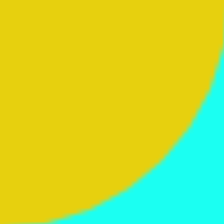
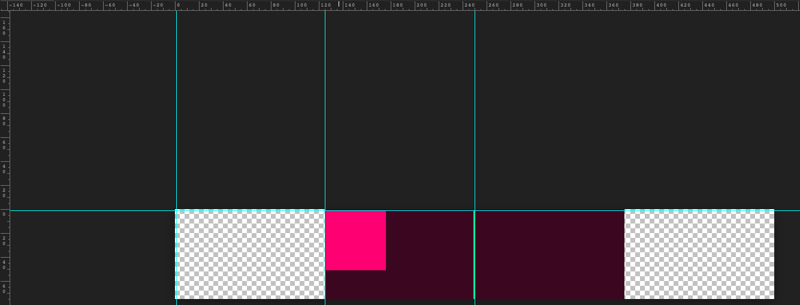

#### SVG
SVG 是一种基于 XML 语法的图像格式，全称是可缩放矢量图（Scalable Vector Graphics）。其他图像格式都是基于像素处理的，SVG 则是属于对图像的形状描述，所以它本质上是文本文件，体积较小，且不管放大多少倍都不会失真。

### 使用

* SVG 文件可以直接插入网页，成为 DOM 的一部分，然后用 JavaScript 和 CSS 进行操作。

```
<!DOCTYPE html>
<html>
<head></head>
<body>
<svg
  id="mysvg"
  xmlns="http://www.w3.org/2000/svg"
  viewBox="0 0 800 600"
  preserveAspectRatio="xMidYMid meet"
>
  <circle id="mycircle" cx="400" cy="300" r="50" />
<svg>
</body>
</html>
```
* SVG 代码也可以写在一个独立文件中，然后用```、<object>、<embed>、<iframe>```等标签插入网页

```

<object id="object" data="circle.svg" type="image/svg+xml"></object>
<embed id="embed" src="icon.svg" type="image/svg+xml">
<iframe id="iframe" src="icon.svg"></iframe>
```
* CSS 也可以使用 SVG 文件。

```
.logo {
  background: url(icon.svg);
}
```

* SVG 文件还可以转为 BASE64 编码，然后作为 Data URI 写入网页。
```

```

#### 语法

```
<svg width="100%" height="100%">
  <circle id="mycircle" cx="50" cy="50" r="50" />
</svg>
```


```<svg>```的width属性和height属性，指定了 SVG 图像在 HTML 元素中所占据的宽度和高度。除了相对单位，也可以采用绝对单位（单位：像素）。

#### viewBox

SVG就像是我们的显示器屏幕，viewBox就是截屏工具选中的那个框框（只不过这个框框是整个viewbox的范围，可能大于viewport的视口），最终的呈现就是把框框中的截屏内容再次在显示器中全屏显示

用户坐标系统和视窗坐标系统宽高比（高比宽）相同，它会延伸或者是缩放来适应整个视窗区域
如果你的用户坐标系宽高比不同，你可以用preserveAspectRatio属性来声明整个系统在视窗内是否可见，你也可以用它来声明在视窗中如何定位。

viewBox参数

viewBox="x, y, width, height" // x:左上角横坐标，y:左上角纵坐标，width:宽度，height:高度


```<viewBox>```属性的值有四个数字，分别是左上角的横坐标和纵坐标、视口的宽度和高度

```
<svg width="100" height="100" viewBox="50 50 50 50">
  <circle id="mycircle" cx="50" cy="50" r="50" />
</svg>
```

上面代码中，SVG 图像是100像素宽 x 100像素高，viewBox属性指定视口从(50, 50)这个点开始。所以，实际看到的是右下角的四分之一圆


注意，视口必须适配所在的空间。上面代码中，视口的大小是 50 x 50(上图蓝绿色方块部分为视口大小)，由于 SVG 图像的大小是 100 x 100，所以视口会放大去适配 SVG 图像的大小，即放大了四倍。


如果不指定width属性和height属性，只指定viewBox属性，则相当于只给定 SVG 图像的长宽比。这时，SVG 图像的默认大小将等于所在的 HTML 元素的大小。 示例如下：

```
<svg viewBox="50 50 50 50">
  <circle id="mycircle" cx="50" cy="50" r="50" />
</svg>
```





#### circle 代表圆形

```
<svg width="300" height="180">
  <circle cx="30"  cy="50" r="25" />
  <circle cx="90"  cy="50" r="25" class="red" />
  <circle cx="150" cy="50" r="25" class="fancy" />
</svg>

```


```<circle>```标签的cx、cy、r属性分别为横坐标、纵坐标和半径，单位为像素。坐标都是相对于```<svg>```画布的左上角原点。


SVG 的图形 CSS 属性与网页元素有所不同。

```
fill：填充色
stroke：描边色
stroke-width：边框宽度


.red {
  fill: red;
}

.fancy {
  fill: none;
  stroke: black;
  stroke-width: 3px;
}
```


#### line

line标签用来绘制直线。

```
<svg width="300" height="180">
  <line x1="0" y1="0" x2="200" y2="0" style="stroke:rgb(0,0,0);stroke-width:5" />
</svg>
```

line 标签的x1属性和y1属性，表示线段起点的横坐标和纵坐标；x2属性和y2属性，表示线段终点的横坐标和纵坐标；style属性表示线段的样式。

#### polyline 标签用于绘制折线
```
<svg width="300" height="180">
  <polyline points="3,3 30,28 3,53" fill="none" stroke="black" />
</svg>
```

polyline的points属性指定了每个端点的坐标，横坐标与纵坐标之间与逗号分隔，点与点之间用空格分隔。

#### rect 标签用于绘制矩形

```
<svg width="300" height="180">
  <rect x="0" y="0" height="100" width="200" style="stroke: #70d5dd; fill: #dd524b" />
</svg>

```

rect 的x属性和y属性，指定了矩形左上角端点的横坐标和纵坐标；width属性和height属性指定了矩形的宽度和高度（单位像素）

#### ellipse 标签用于绘制椭圆

```
<svg width="300" height="180">
  <ellipse cx="60" cy="60" ry="40" rx="20" stroke="black" stroke-width="5" fill="silver"/>
</svg>

```

ellipse的cx属性和cy属性，指定了椭圆中心的横坐标和纵坐标（单位像素）；rx属性和ry属性，指定了椭圆横向轴和纵向轴的半径（单位像素）

#### polygon 标签用于绘制多边形
```
<svg width="300" height="180">
  <polygon fill="green" stroke="orange" stroke-width="1" points="0,0 100,0 100,100 0,100 0,0"/>
</svg>
```

polygon的points属性指定了每个端点的坐标，横坐标与纵坐标之间与逗号分隔，点与点之间用空格分隔


#### path 标签用于制路径

```
<svg width="300" height="180">
<path d="
  M 18,3
  L 46,3
  L 46,40
  L 61,40
  L 32,68
  L 3,40
  L 18,40
  Z
"></path>
</svg>
```

path标签的d属性表示绘制顺序，它的值是一个长字符串，每个字母表示一个绘制动作，后面跟着坐标。

```
M：移动到（moveto）
L：画直线到（lineto）
Z：闭合路径
```

#### text标签用于绘制文本
```

<svg width="300" height="180">
  <text x="50" y="25">Hello World</text>
</svg>
```
text标签的x属性和y属性，表示文本区块基线（baseline）起点的横坐标和纵坐标。文字的样式可以用class或style属性指定

#### use标签用于复制一个形状。
```
<svg viewBox="0 0 30 10" xmlns="http://www.w3.org/2000/svg">
  <circle id="myCircle" cx="5" cy="5" r="4"/>

  <use href="#myCircle" x="10" y="0" fill="blue" />
  <use href="#myCircle" x="20" y="0" fill="white" stroke="blue" />
</svg>
```

use标签的href属性指定所要复制的节点，x属性和y属性是<use>左上角的坐标。另外，还可以指定width和height坐标


#### g 标签用于将多个形状组成一个组（group），方便复用
```
<svg width="300" height="100">
  <g id="myCircle">
    <text x="25" y="20">圆形</text>
    <circle cx="50" cy="50" r="20"/>
  </g>

  <use href="#myCircle" x="100" y="0" fill="blue" />
  <use href="#myCircle" x="200" y="0" fill="white" stroke="blue" />
</svg>
```


###   defs 标签
defs 标签用于自定义形状，它内部的代码不会显示，仅供引用


### pattern 标签

pattern标签用于自定义一个形状，该形状可以被引用来平铺一个区域

``` 
例子1 
<svg width="500" height="500">
  <defs>
    <pattern id="dots" x="0" y="0" width="100" height="100" patternUnits="userSpaceOnUse">
      <circle fill="#bee9e8" cx="50" cy="50" r="35" />
    </pattern>
  </defs>
  <rect x="0" y="0" width="100%" height="100%" fill="url(#dots)" />
</svg>
```

```<pattern>```标签将一个圆形定义为dots模式。patternUnits="userSpaceOnUse"表示<pattern>的宽度和长度是实际的像素值。然后，指定这个模式去填充下面的矩形。
```
 <circle fill="#bee9e8" cx="50" cy="50" r="35" />
```


例子1： 结果如下


#### image标签用于插入图片文件
```
<svg viewBox="0 0 100 100" width="100" height="100">
  <image xlink:href="path/to/image.jpg"
    width="50%" height="50%"/>
</svg>
```

#### animate 标签用于产生动画

```

<svg width="500px" height="500px">
  <rect x="0" y="0" width="100" height="100" fill="#feac5e">
    <animate attributeName="x" from="0" to="500" dur="2s" repeatCount="indefinite" />
  </rect>
</svg>

上面代码中，矩形会不断移动，产生动画效果。

<animate>的属性含义如下:
attributeName：发生动画效果的属性名。
from：单次动画的初始值。
to：单次动画的结束值。
dur：单次动画的持续时间。
repeatCount：动画的循环模式。

可以在多个属性上面定义动画:
<animate attributeName="x" from="0" to="500" dur="2s" repeatCount="indefinite" />
<animate attributeName="width" to="500" dur="2s" repeatCount="indefinite" />
```

#### animateTransform 标签 -- no 没看明白

```
<animate>标签对 CSS 的transform属性不起作用，如果需要变形，就要使用<animateTransform>标签。

<svg width="500px" height="500px">
  <rect x="250" y="250" width="50" height="50" fill="#4bc0c8">
    <animateTransform attributeName="transform" type="rotate" begin="0s" dur="10s" from="0 200 200" to="360 400 400" repeatCount="indefinite" />
  </rect>
</svg>

```

```<animateTransform>```的效果为旋转（rotate），这时from和to属性值有三个数字，第一个数字是角度值，第二个值和第三个值是旋转中心的坐标。from="0 200 200"表示开始时，角度为0，围绕(200, 200)开始旋转；to="360 400 400"表示结束时，角度为360，围绕(400, 400)旋转。


#### 读取 SVG 源码

由于 SVG 文件就是一段 XML 文本，因此可以通过读取 XML 代码的方式，读取 SVG 源码。
```
<div id="svg-container">
  <svg
    xmlns="http://www.w3.org/2000/svg"
    xmlns:xlink="http://www.w3.org/1999/xlink"
    xml:space="preserve" width="500" height="440"
  >
    <!-- svg code -->
  </svg>
</div>
```

使用XMLSerializer实例的serializeToString()方法，获取 SVG 元素的代码。

```
var svgString = new XMLSerializer()
  .serializeToString(document.querySelector('svg'));
```


#### 画折线图 实例


```
    <!-- 
Date |Amount
-----|------
2014-01-01 | $10
2014-02-01 | $20
2014-03-01 | $40
2014-04-01 | $80 
-->

<svg width="350" height="160">
  <g class="layer" transform="translate(60,10)">
    <circle r="5" cx="0"   cy="105" />
    <circle r="5" cx="90"  cy="90"  />
    <circle r="5" cx="180" cy="60"  />
    <circle r="5" cx="270" cy="0"   />

    <g class="y axis">
      <line x1="0" y1="0" x2="0" y2="120" style="stroke:rgb(0,0,0);stroke-width:5"/>
      <text x="-40" y="105" dy="5">$10</text>
      <text x="-40" y="0"   dy="5">$80</text>
    </g>
    <g class="x axis" transform="translate(0, 120)">
      <line x1="0" y1="0" x2="270" y2="0" style="stroke:rgb(0,0,0);stroke-width:5"/>
      <text x="-30"   y="20">January</text>
      <text x="240" y="20">April</text>
    </g>
  </g>
</svg>
```


#### 补充

inline SVG 支持资源外链 支持CSS 支持JS

img SVG 不支持资源外链 支持内部CSS 不支持JS

background-img SVG 不支持资源外链 支持内部CSS 不支持JS

background-img BASE64 SVG 不支持资源外链 支持内部CSS 不支持JS

object SVG 支持资源外链 支持内部CSS 支持内部JS

embed SVG 支持资源外链 支持内部CSS 支持内部JS

iframe SVG 支持资源外链 支持内部CSS 支持内部JS

#### preserveAspectRatio

https://segmentfault.com/a/1190000015661109

```
preserveAspectRatio 在viewbox 和viewport的宽高比不同时 默认为xMidYMid

<svg width="500" height="75" viewBox="0 0 250 75"
     preserveAspectRatio="xMidYMid"
     style="background:#000;margin-left: 10px;">
 
    <rect x="1" y="1" width="50" height="50"
          style="fill:#000000;"/>
</svg>  
```


具体原因：




例子2：

```
<svg id="svg" width="400" height="200" viewBox="0 0 300 300" style="background: green;margin-left:10px;">
    <rect x="0" y="0" width="100" height="100" fill="#cd0000" />
</svg>
```

具体原因：

```
绿色是画布
青色为显示的rect形状 
深绿色是viewbox区域  因为viewbox区域是300 300 而画布本身的大小是400 200 按照最小缩放比  viewbox 应该是200 200
```

