### 我有一只小毛驴我从来也不骑
### 有一天我心血来潮骑着去赶集
### 我手里拿着小皮鞭我心里正得意
### 不知怎么哗拉拉拉拉我摔了一身泥


### 心血来潮研究下svg，蹦了我一身泥

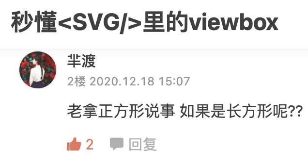

作者说viewbox像我们手机摄像图的截图功能一样，截取图片局部填满整个区域
例子：
```
<svg width="200" height="200" viewbox="0 0 100 100" style="background-color:#ccc">
	<rect x="0" y="0" width="50" height="50"
          style="fill:#000000;"/>
</svg>
```
结果：
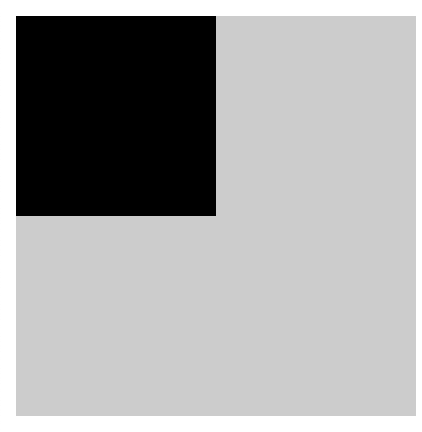
<br/>
我试着推算一下：
黑色为rect图形区域，透明的为viewBox区域（虚拟区域)，灰色为svg画布区域
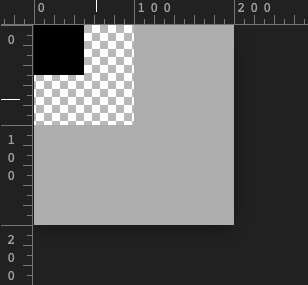

放大viewbox（虚拟区域）填满整个svg画布，这样的解释很完美。

楼上这位仁兄说的长方形是啥意思，我心思一动，把viewbox的宽度改为150试一下，这不就是长方形了么？

```
<svg width="200" height="200" viewbox="0 0 150 100" style="background-color:#ccc">
	<rect x="0" y="0" width="50" height="50"
          style="fill:#000000;"/>
</svg>
```
展示结果：
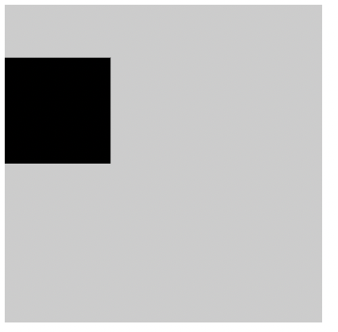

我内心的推算：
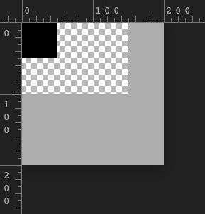
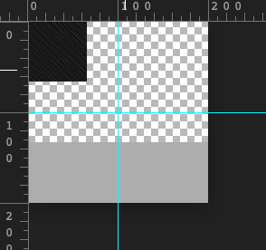

咋又不是截屏了呢？？

哈？？？？ 啥？？？？


到底有什么隐藏的猫腻呢？？？


先讲探秘需要的基础知识：

### svg
SVG 全称 Scalable Vector Graphics (可缩放矢量图形)。它是一种用来描述二维矢量图形的 XML 标记语言。


#### SVG 值的单位

在 SVG 中，你可以指定值的单位，也可以不指定值的单位。如果不指定值的单位，则默认使用像素 (px) 作为单位。

#### SVG 画布

SVG 画布就是用来绘制 SVG 内容的一个区域。这个画布可以无限延伸，你可以在这个画布的任何位置绘制你想要的内容。

#### SVG 视窗（viewport）

SVG 视窗和浏览器视窗很像。你可以通过 SVG 视窗看到画布，但其实你只看到了画布的一部分，超过视窗的部分会被裁切并且隐藏。就像一个网页，它可能比浏览器的视窗宽，可能比浏览器的视窗长，但只有在视窗内的页面是可见的。


#### 深入理解画布和视窗

为了更好的去理解这两个抽象概念，你可以把视窗想象成飞机上的窗户，把画布想象成无穷无尽的风景，只有在这个窗口内的风景才能被看到。

#### 画布和视窗之间的关联

每创建一个 ```<svg>``` 元素，就相当于创建了一个无穷大的画布，同时创建了一个视窗。
画布和视窗分别对应两个坐标系统，一个用户坐标系，一个视窗坐标系，这两个坐标系统默认是对齐的

#### 网格坐标系

* 和很多计算机绘图所使用的坐标系统一样，SVG 也使用了网格坐标系统。这种坐标系有如下几个特点:

* 以左上角为坐标系的原点(0,0),X 轴的正方向向右，从 0,0 点开始向右， x 逐渐增大。Y 轴的正方向向下，从 0,0 点开始向下， y 逐渐增大。
* 坐标以像素为单位

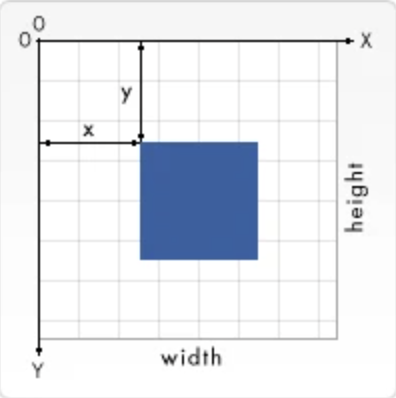


#### 初始坐标系

* 视窗坐标系就是建立在视窗上的坐标系，
* 用户坐标系是建立在 SVG 画布上的坐标系，也称当前坐标系。

这两个坐标系一开始是完全重合的，它们的原点和坐标都是完全一致的，也就是说初始用户坐标系的原点就位于视窗的左上角，也是 X 轴正向向右，Y 轴正向向下。

虽然一开始它们是两个完全一样的坐标系，但既然是两个坐标系，就意味着它们可以是不一样的。你可以通过 viewBox 去改变这种默认对齐的方式


#### viewBox


viewBox 是用来把 SVG 内容绘制到画布上的坐标系。它的字面意思是视图盒子，只有出现在这个盒子区域里面的 SVG 内容才能被看到，你可以理解为 SVG 图形真正的可见区域。

#### viewBox 语法
```
viewBox = <min-x> <min-y> <width> <height>

```

viewBox 接收四个参数值，分别是 min-x，min-y，width，height。

min-x 和 min-y 决定了 viewBox 的左上角，width 和 height 决定了 viewBox 的宽和高。注意 width 或 height 如果设置成 0 ，会禁止元素的渲染。


viewBox 是如何来适应视窗的呢？？？

分两种情况
1. 一种是viewBox的宽高比与SVG视窗的宽高比相同，这种直接通过放大或者缩小viewbox 到SVG视窗即可，就是秒懂的情况
2. 没有瞬间秒懂的那种情况：当viewBox的宽高比与SVG视窗的宽高比不相同时，需要拉伸viewBox来适应视窗的时候，就需要preserveAspectRatio 来登场了，preserveAspectRatio值默认就是在坐标系中垂直居中

#### preserveAspectRatio 语法
```
preserveAspectRatio = <align> <meetOrSlice>?

```
align 表示 viewBox 如何与 viewport 对齐。
meetOrSlice 是可选的，表示如何保持宽高比。


#### align

align 的值有很多，为了方便理解，我们先把它最基本的值拆分出来，如下:

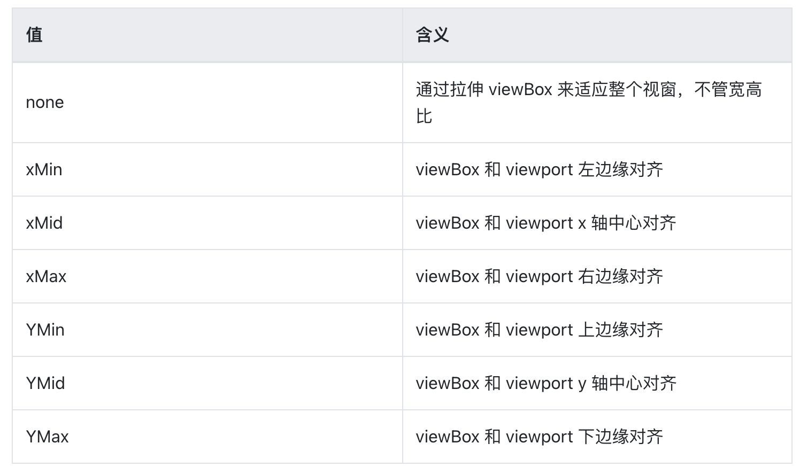

然后再自由组合 x,y 就能可以了，比如：

xMinYMin => 左-上对齐
xMidYmid => 中-中对齐

#### meetOrSlice
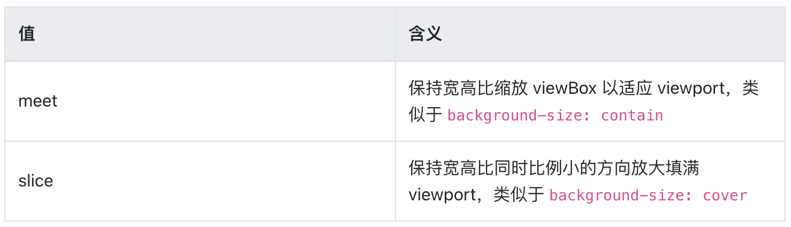

##### 来，我们揭开宽高比不同的面纱
* 重点宽高比不同时,preserveAspectRatio 默认垂直居中即 preserveAspectRatio = "xMidyMid"

#### 根据这个知识点，回顾下，让我发蒙的那个展现
```
<svg width="200" height="200" viewbox="0 0 150 100" style="background-color:#ccc">
	<rect x="0" y="0" width="50" height="50"
          style="fill:#000000;"/>
</svg>
```

既然垂直居中，缩放至整个视口，那么我们要找出缩放比例

视口宽/viewBox宽 = X轴系数  = 200/150 = 1.3333333333333333

视口高/viewBox高 = Y轴系数 = 200/100 = 2

我们选择系数小的 作为最终缩放系数 1.33333，为啥不选择系数大的，因为viewBox要完全显示在画布上。

svg图形rect 宽高 缩放后为50*1.33333 = 66.66666

viewBox的宽为 150*1.33333 = 250

viewBox的高位 100* 1.33333 = 133.3333

```<min-x>``` 为0*1.33333= 0
```<min-y>```为0*1.33333= 0

下面是演进过程：初始表现 -> 根据preserveAspectRatio = "xMidyMid" 移动viewBox坐标 -> 根据选定系数进行缩放viewBox -> 最终表现（透明为viewBox区域，黑色为svg中的rect图形区域,灰色为svg视图区域）


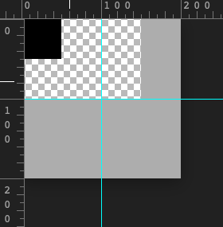
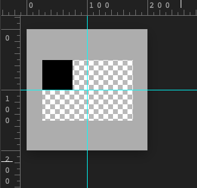
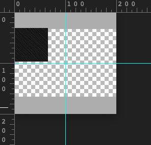


#### 破案了！！！！


<br />

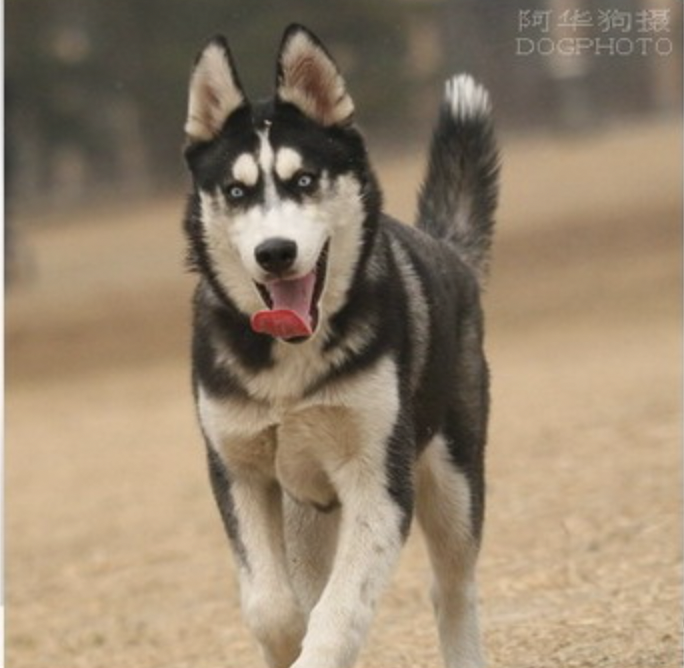


