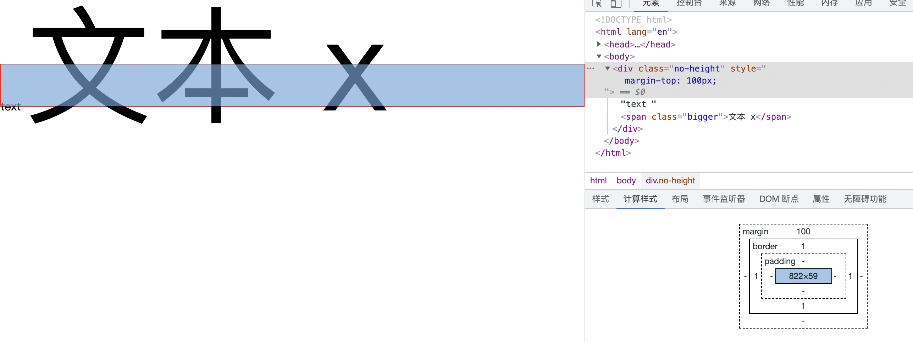
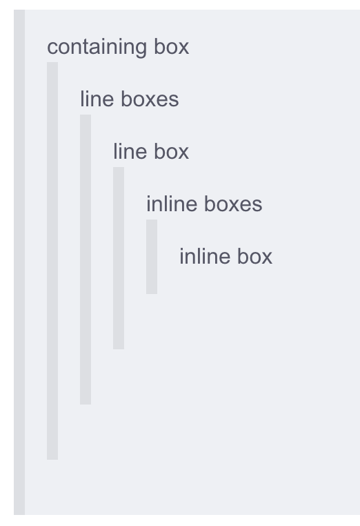
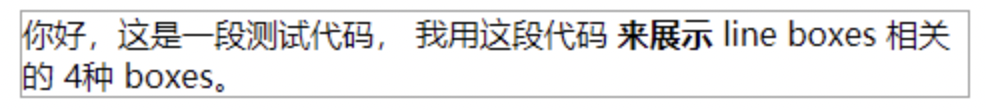

当line-box的line-height为0，span有一个更大的font-size,line-box会有一个高度



这个高度是怎么产生的呢？


####  那么什么是line-box
每一行称为一条Line Box，它又是由这一行的许多inline-box组成，line boxes的高度垂直堆叠形成了containing box的高度，就是我们见到的div或是p标签之类的高度了。

line box的高度是inline boxes的最高点与最低点之间的距离

line-box 的高度是由它所有子元素的高度计算得出的


为了让我们能够更加深入的理解line box，我将按照从大到小的顺序来介绍其相关内容。
他们的包含关系大致如下:


1. containing box由多个line box组成。
2. 堆叠line boxes的高度就是containing box的高度
3. 每一行内容就是一条line box。
4. line box由该行的多个inline box组成
5. inline box包含很多内容，包括em框、内容区、行间距、行内框、行框等等。

### Inline Box 内联盒子
即一个盒子对外显示为 inline
那么他的行为如下:

1.盒子不会产生换行。
2.width 和 height 属性将不起作用。
3.垂直方向的内边距、外边距以及边框会被应用但是不会把其他处于 inline 状态的盒子推开。
4.水平方向的内边距、外边距以及边框会被应用且会把其他处于 inline 状态的盒子推开。
```
ps:用做链接的 <a> 元素、 <span>、 <em> 以及 <strong> 都是默认处于 inline 状态的。
```

看下面的例子

```
<div>
    你好，这是一段测试代码，
    <span>我用这段代码</span>
    <b>来展示</b>
    line boxes 相关的 4种 boxes。
</div>
```

结果如图




