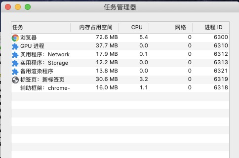
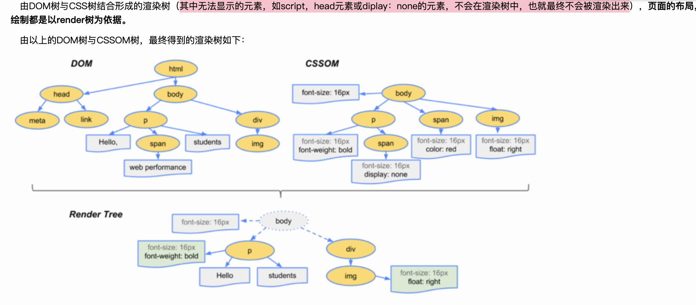

Chrome 打开一个页面需要启动多少进程？你可以点击 Chrome 浏览器右上角的“选项”菜单，选择“更多工具”子菜单，点击“任务管理器”，这将打开 Chrome 的任务管理器的窗口，如图




只是打开了 1 个页面，为什么要启动这么多进程呢？

正常情况下程序可以使用单线程来处理，也就是分四步按照顺序分别执行这四个任务。
 

如果采用多线程，会怎么样呢？我们只需分“两步走”：第一步，使用三个线程同时执行前三个任务；第二步，再执行第四个显示任务。

进程和线程的关系
```
可以这样理解：

 - 进程是一个工厂，每个工厂有其独立的资源。

 - 线程是工厂中的工人，可能只有一个，可能有好多个。多个工人协同完成工作。工人共享工作资源。

回到硬件上来理解：

 - 工厂的资源 -> 系统分配的内存。

 - 工厂之间相互独立 -> 进程之间相互独立，也即进程分配到的内存相互独立，无法读到对方内存中的数据。

 - 一个工厂有一个或多个工人 -> 一个线程中有一个或多个线程。

 - 多个工人协同完成工作 -> 进程中多个线程协同完成工作。即线程之间能互相发送请求与接收结果。

 - 工人共享工作资源 -> 进程中所有线程都能访问到相同一块内存，即信息是互通的。
 ```

多线程可以并行处理任务，但是线程是不能单独存在的，它是由进程来启动和管理的。
 

那什么又是进程呢？一个进程就是一个程序的运行实例。详细解释就是，启动一个程序的时候，操作系统会为该程序创建一块内存，用来存放代码、运行中的数据和一个执行任务的主线程，我们把这样的一个运行环境叫进程。
 

 
```
进程和线程之间的关系有以下 4 个特点：
1. 进程中的任意一线程执行出错，都会导致整个进程的崩溃。
2. 线程之间共享进程中的数据。
3. 当一个进程关闭之后，操作系统会回收进程所占用的内存
4. 进程之间的内容相互隔离。
 
 ```

单进程时代：如此多的功能模块运行在一个进程里，是导致单进程浏览器不稳定、不流畅和不安全的一个主要因素
多进程时代：稳定，流畅，安全

#### 多进程架构

##### 浏览器进程

主要负责界面显示、用户交互、子进程管理，同时提供存储等功能。

```
 Browser进程 : 是浏览器的主进程，负责主控，协调，只有一个，可以看做是浏览器的大脑。 

   1. 负责下载页面的网络文件 （由网络进程负责了）
   2. 负责将renderer（渲染）进程得到的存在内存中的位图渲染（显示）到页面上 
   3. 负责创建和销毁tab进程（renderer进程） 
   4. 负责与用户的交互 

 ```
 

#####  渲染进程。
核心任务是将 HTML、CSS 和 JavaScript 转换为用户可以与之交互的网页，排版引擎 Blink 和 JavaScript 引擎 V8 都是运行在该进程中，默认情况下，Chrome 会为每个 Tab 标签创建一个渲染进程。出于安全考虑，渲染进程都是运行在沙箱模式下。
```
又名浏览器内核，每个tab页面对应一个独立的renderer进程，内部有多个线程。 
1.负责脚本执行
2.位图绘制
3.事件触发
4.任务队列轮询等 
 ```
 ```
 #### 渲染进程中的线程有如下几个
1.GUI 渲染线程
   用于解析html为DOM树，解析css为CSSOM树，布局layout，绘制paint 
    - 当页面需要重排reflow，重绘repaint时，使用该线程
2.JavaScript引擎线程
  也称js内核，解析js脚本，执行代码
  与GUI线程互斥，即当js引擎线程运行时，GUI线程会被挂起，当js引擎线程结束运行时，才会继续运行GUI线程
3.定时触发器线程
   对应于setTimeout，setInterval API，由该线程来计时，当计时结束，将事件对应的回调函数放入任务队列中 
   当setTimeout的定时的时间小于4ms，一律按4ms来算
4.事件触发线程
  当对应事件触发（不论是WebAPIs完成事件触发，还是页面交互事件触发）时，
  该线程会将事件对应的回调函数放入callback queue（任务队列）中，等待js引擎线程的处理 
5.异步http请求线程
  在XMLHttpRequest在连接后是通过浏览器新开一个线程请求， 将检测到状态变更时，如果设置有回调函数，异步线程就产生状态变更事件放到 JavaScript引擎的处理队列中等待处理。
 ```

 

##### GPU 进程。
其实，Chrome 刚开始发布的时候是没有 GPU 进程的。而 GPU 的使用初衷是为了实现 3D CSS 的效果，只是随后网页、Chrome 的 UI 界面都选择采用 GPU 来绘制，这使得 GPU 成为浏览器普遍的需求。最后，Chrome 在其多进程架构上也引入了 GPU 进程。

```
负责3D绘制，只有当该页面使用了硬件加速才会使用它，来渲染（显示）页面。否则的话，不使用这个进程，而是用Browser进程来渲染（显示）页面
 ```
 

##### 网络进程。
主要负责页面的网络资源加载，之前是作为一个模块运行在浏览器进程里面的，直至最近才独立出来，成为一个单独的进程。
 

##### 插件进程。
主要是负责插件的运行，因插件易崩溃，所以需要通过插件进程来隔离，以保证插件进程崩溃不会对浏览器和页面造成影响。


#### render




#### 回流与重绘
 在此之前，我们先明确另外两个概念：布局与绘制。
```

 - 布局是页面首次加载时进行的操作，重新布局即为回流。

 - 绘制是页面首次加载时进行的操作，重新绘制即为重绘。
 ```

#### 什么时候会发生回流和重绘
```
 当页面的某部分元素发生了尺寸、位置、隐藏发生了改变，页面进行回流。
 得对整个页面重新进行布局计算，将所有尺寸，位置受到影响的元素回流。 

 - 当页面的某部分元素的外观发生了改变，但尺寸、位置、隐藏没有改变，
 页面进行重绘。（同样，只重绘部分元素，而不是整个页面重绘）
 
 - 回流的同时往往会伴随着重绘，重绘不一定导致回流。
 - 所以回流导致的代价是大于重绘的。
```


#### 那么具体什么操作会引起回流呢
```
1.页面初始化渲染
2.窗口的尺寸变化
3.元素的尺寸、位置、隐藏变化
4. DOM结构发生变化，如删除节点
5. 获取某些属性，引发回流 
很多浏览器会对回流进行优化，一定时间段后或数量达到阕值时，做一次批处理回流。
 当获取一些属性时，浏览器为了返回正确的值也会触发回流，导致浏览器优化无效，有： 
 1. offset（top/bottom/left/right）
  2. client (top/bottom/left/right) 
  3. scroll (top/bottom/left/right) 
  4. getComputedStyle() 
  5. width,height - 其次，字体大小修改及内容更新也会导致回流
```


#### 那么如何减少回流呢
```
1. 减少逐项更改样式，最好一次性更改style，或是将更改的样式定义在class中并一次性更新
2. 避免循环操作DOM，而是新建一个节点，在他上面应用所有DOM操作，然后再将他接入到DOM中
3. 当要频繁得到如offset属性时，只读取一次然后赋值给变量，而不是每次都获取一次
4. 将复杂的元素绝对定位或固定定位，使他脱离文档流，否则回流代价很高 
5. 使用硬件加速创建一个新的复合图层，当其需要回流时不会影响原始复合图层回流

```


## 硬件加速
 我们在未开启硬件加速的时候是使用cpu来渲染页面，只有开启了硬件加速了，才会使用到GPU渲染页面。

#### 简单图层和复合图层
```
- DOM中的每个结点对应一个简单图层 
- 复合图层是各个简单图层的合并，一个页面一般来说只有一个复合图层，无论你创建了多少个元素，都是在这个复合图层中 
- 其次，absolute、fixed布局，可以使该元素脱离文档流，
但还是在这个复合图层中，所以他还是会影响复合图层的绘制，但不会影响重排

**当一个元素使用硬件加速后，会生成一个新的复合图层**，
这样不管其如何变化，都不会影响原复合图层。不过不要大量使用硬件加速，会导致资源消耗过度，导致页面也卡。

所以，使用了硬件加速后，会有多个复合图层，然后多个复合图层互相独立，单独布局、绘制。
```

#### 如何才能使用硬件加速
```
1. translate3d,translateZ
2. opacity属性
```
### 硬件加速时请使用z-index
 
具体原理是这样的：
```
 当一个元素使用了硬件加速，在其后的元素，若z-index比他大或者相同，
 且absolute或fixed的属性相同，则默认为这些元素也创建各自的复合图层。
 所以我们人为地为这个元素添加z-index值，从而避免这种情况
```


## 浏览器页面的渲染流程

```
1. 解析html得到DOM树

 2. 解析css得到CSS树

 3. 合并得到render树

 4. 布局，当页面有元素的尺寸、大小、隐藏有变化或增加、删除元素时，重新布局计算，并修改页面中所有受影响的部分

 5. 绘制，当页面有元素的外观发生变化时，重新绘制

 6. GUI线程将得到的各层的位图（每个元素对应一个普通图层）发送给Browser进程，由Browser进程将各层合并，渲染在页面上
```

#### DOMContentLoaded和load事件

```
 这两者的差别，由其定义就可知：
 - DOMContentLoaded：当DOM加载完成触发
 - load：当DOM，样式表，脚本都加载完时触发
```


### css的堵塞情况
 首先，是在Browser进程中下载css文件，当下载完成后，发送给GUI线程。

 其次，是在GUI线程中解析html及css，不过这两者是并行的。

 由于css的下载和解析不会影响DOM树，所以不会堵塞html文件的解析，但会堵塞页面渲染。

 这样的设计是非常合理的，如果css文件的下载和解析不会堵塞页面渲染，那么在页面渲染的途中或结束后发现元素样式有变化，则又需要回流和重绘。


### js的堵塞情况
 明确的是，js文件的下载和解析执行都会堵塞html文件的解析及页面渲染。

 因为js脚本可能会改变DOM结构，若是其不堵塞html文件的解析及页面渲染的话，那么当js脚本改变DOM结构或元素样式时，会引发回流和重绘，会造成不必要的性能浪费，不如等待js执行完，在进行html解析和页面渲染。

 如果你不想js堵塞的话，则使用async属性，这样就可以异步加载js文件，加载完成后立即执行。

### css和js文件应当放在html哪个位置
 
 **js：**
```
 当需要在DOM树完成之前用js进行初始化操作的话，在head中使用js。

 如果是需要在DOM树形成之后，即要操作DOM，则在body元素的末尾。不过也可以使用load事件。

 如果js的内容比较小，则推荐使用内部js而不是引用js，这样可以减少http请求。
```

 **css：**
```
 一般放在head中，因为css的解析不影响html的解析，所以越早引入，越早同时解析。
```

### 宏任务和微任务
宏任务（macrotask）：

```
 - 主代码块和任务队列中的回调函数就是宏任务。
 - 为了使js内部宏任务和DOM任务能够有序的执行，每次执行完宏任务后，
会在下一个宏任务执行之前，对页面重新进行渲染。（宏任务 -> 渲染 -> 宏任务）
```


#### 微任务（microtask）：
```
 - 在宏任务执行过程中，执行到微任务时，将微任务放入微任务队列中。
 - 在宏任务执行完后，在重新渲染之前执行。
 - 当一个宏任务执行完后，他会将产生的所有微任务执行完。
```

#### 分别在什么场景下会产生宏任务或微任务呢：

宏任务：主代码块，setTimeout，setInterval（任务队列中的所有回调函数都是宏任务）

微任务：Promise,nextTick


#### 导致页面无法立即响应的原因
 导致页面无法响应的原因是执行栈中还有任务未执行完，或者是js引擎线程被GUI线程堵塞。


## html文件解析过程
```
 这个过程是在下载html文件之后，不包括网络请求过程

 1. Browser进程下载html文件并将文件发送给renderer进程

 2. renderer进程的GUI线程开始解析html文件来构建出DOM

 3. 当遇到外源css时，Browser进程下载该css文件并发送回来，GUI线程再解析该文件，在这同时，html的解析也同时进行，但不会渲染（还未形成渲染树）

 4. 当遇到内部css时，html的解析和css的解析同时进行

 5. 继续解析html文件，当遇到外源js时，Browser进程下载该js文件并发送回来，此时，js引擎线程解析并执行js，因为GUI线程和js引擎线程互斥，所以GUI线程被挂起，停止继续解析html。直到js引擎线程空闲，GUI线程继续解析html。

 6. 遇到内部js也是同理

 7. 解析完html文件，形成了完整的DOM树，也解析完了css，形成了完整的CSSOM树，两者结合形成了render树

 8. 根据render树来进行布局，若在布局的过程中发生了元素尺寸、位置、隐藏的变化或增加、删除元素时，则进行回流，修改

 9. 根据render树进行绘制，若在布局的过程中元素的外观发生变换，则进行重绘

 10. 将布局、绘制得到的各个简单图层的位图发送给Browser进程，由它来合并简单图层为复合图层，从而显示到页面上

 11. 以上步骤就是html文件解析全过程，完成之后，如若当页面有元素的尺寸、大小、隐藏有变化时，重新布局计算回流，并修改页面中所有受影响的部分，如若当页面有元素的外观发生变化时，重绘
```

