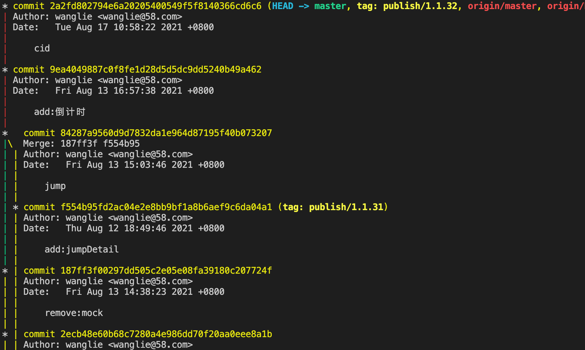

查看git log

*已图形的方式查看log 
--online 一行
```
git log --graph --online
```




git log可以显示所有提交过的版本信息，不包括已经被删除的 commit 记录和 reset 的操作

git reflog是显示所有的操作记录，包括提交，回退的操作。一般用来找出操作记录中的版本号，进行回退。

git reflog常用于恢复本地的错误操作。

场景：我们commit了一个操作，发现提交的是错误的，我们进行了回退，git reset HEAD^,也进行了checkout 操作，就是把工作区的文件也回退还原了，这时候发现commit的没有问题。等于说删了不该删的了，咋整，想再回退到删除之前的。找到之前的版本号进行回退，使用git log发现那个提交的版本号记录根本不存在了。


如图我提交了两次，git log中显示了两次commit的版本号

现在我们认为第二次提交是错误的，我们进行了回退 gti reset HEAD^和git checkout filename

回退之后我们又发现不应该回退，想在回退回去。找到之前的版本号，git log

第二次的提交版本号日志没有了。这就尴尬了。这是 git reflog就提现作用了

从文件clone开始，所有的操作记录日志都有了。

找到 第二次提交git reflog 前面的版本号进行 git reset 就行啦