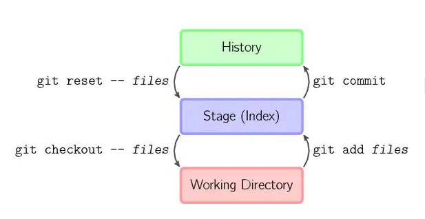

#### git简单的分为三个区域 ：

```
1、工作区（working directory）

2、暂缓区（stage index）

3、历史记录区（history）

```


### git reset --hard xxx 

hard （修改版本库，修改暂存区，修改工作区）

--hard HEAD～1 (或是版本号)意为将版本库回退1个版本，但是不仅仅是将本地版本库的头指针全部重置到指定版本，也会重置暂存区，并且会将工作区代码也回退到这个版本

### git reset --soft xxx

soft （修改版本库，保留暂存区，保留工作区）


### git revert xxx
revert
-- git revert 也是撤销命令，区别在于reset是指向原地或者向前移动指针，git revert是创建一个commit来覆盖当前的commit，指针向后移动。


### git revert和git reset的区别
git revert与git reset最大的不同是，git revert 仅仅是撤销某次提交，而git reset会将撤销点之后的操作都回退到暂存区中。

1、git revert是用一次新的commit来回滚之前的commit，git reset是直接删除指定的commit。

2、在回滚这一操作上看，效果差不多。但是在日后继续merge以前的老版本时有区别。

因为git revert是用一次逆向的commit“中和”之前的提交，因此日后合并老的branch时，导致这部分改变不会再次出现，但是git reset是之间把某些commit在某个branch上删除，因而和老的branch再次merge时，这些被回滚的commit应该还会被引入。

3、git reset 是把HEAD向后移动了一下，而git revert是HEAD继续前进，只是新的commit的内容和要revert的内容正好相反，能够抵消要被revert的内容。

#### git reset 缺点

由于reset方式HEAD指针后移，推送到远端时需要有强制更新权限或者删除分支权限


### 附：不得不提的git的其它删除命令（类似于Linux的命令）：

git rm --cached readme.txt 只从缓存区中删除readme.txt，保留物理文件
git rm readme.txt 不但从缓存区中删除，同时删除物理文件
git mv a.txt b.txt 把a.txt改名为b.txt

