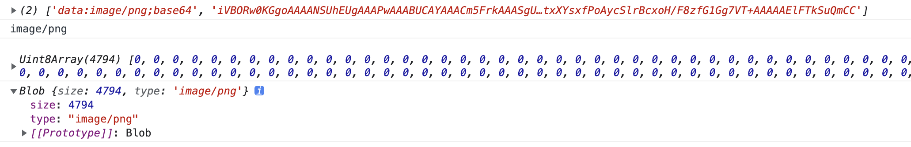

```
let baseObject ={
    url:"data:image/png;base64,iVBORw0KGgoAAAANSUhEUgAAAPwAAABUCAYAAACm5FrkAAASgUlEQVR42uzdCVSVZR7H8Rcw1MGtgkREDxkmElsaHdfJhfSYS2XiUk2ppamZgaY5SaA2mZUpjo
}


   function base64ToBlob(urlData, type) {
    let arr = urlData.split(',');
    console.log(arr)
    let mime = arr[0].match(/:(.*?);/)[1];
    console.log(mime)
    // 去掉url的头，并转化为byte
    let bytes = window.atob(arr[1]);
    // console.log(bytes)
    // 处理异常,将ascii码小于0的转换为大于0
    let ab = new ArrayBuffer(bytes.length);
    // 生成视图（直接针对内存）：8位无符号整数，长度1个字节
    let ia = new Uint8Array(ab);
    console.log(ia)
    for (let i = 0; i < bytes.length; i++) {
      ia[i] = bytes.charCodeAt(i);
    }
    return new Blob([ab], {
      type: mime
    });
  }

  // if (hasFiles.file.size > 1024 * 1024 * 10) {
  //   throw '文件超过10M'
  // }
  let conversions = base64ToBlob(baseObject.url)
  console.log(conversions)   
```


#### Blob
Blob(binary large object)，二进制类文件大对象，是一个可以存储二进制文件的“容器”，HTML5中的Blob对象除了存放二进制数据外还可以设置这个数据的MIME类型。File接口基于Blob，继承了 blob 的功能并将其扩展使其支持用户系统上的文件。
```
new Blob([data], {type: "application/octet-binary"})
```
Blob构造函数接受两个参数，第一个参数是一个包含实际数据的数组，第二个参数是数据的MIME类型。
`` Blob.size`` 
blob对象的数据大小
``Blob.type``
表示blob对象所包含数据的MIME类型。如果实例化时未指明类型，则该值为空字符串。

``Blob.slice``
相当于数组Array.slice方法，表示截取指定范围的数据，形成新的blob对象。

```
    var data1 = "a";
    var data2 = "b";
    var data3 = "<div style='color:red;'>This is a blob</div>";
    var data4 = { "name": "abc" };

    var blob1 = new Blob([data1]);
    var blob2 = new Blob([data1, data2]);
    var blob3 = new Blob([data3]);
    var blob4 = new Blob([JSON.stringify(data4)]);
    var blob5 = new Blob([data4]);
    var blob6 = new Blob([data3, data4]);

    console.log(blob1);  //输出：Blob {size: 1, type: ""}
    console.log(blob2);  //输出：Blob {size: 2, type: ""}
    console.log(blob3);  //输出：Blob {size: 44, type: ""}
    console.log(blob4);  //输出：Blob {size: 14, type: ""}
    console.log(blob5);  //输出：Blob {size: 15, type: ""}
    console.log(blob6);  //输出：Blob {size: 59, type: ""}
```

size代表Blob 对象中所包含数据的字节数。这里要注意，使用字符串和普通对象创建Blob时的不同，blob4使用通过JSON.stringify把data4对象转换成json字符串，blob5则直接使用data4创建，两个对象的size分别为14和15。blob4的size等于14很容易理解，因为JSON.stringify(data4)的结果为："{"name":"abc"}"，正好14个字节(不包含最外层的引号)。blob5的size等于15是如何计算而来的呢？实际上，当使用普通对象创建Blob对象时，相当于调用了普通对象的toString()方法得到字符串数据，然后再创建Blob对象。所以，blob5保存的数据是"[object Object]"，是15个字节(不包含最外层的引号)。

### 应用

#### 图片选择与下载
```
  <input type="file" value="点我" id="inputImg" onchange="changeHandle(this)">
    

let changeHandle = (file) =>{
    var reader = new FileReader();
    reader.onload = function(evt){
        document.getElementById('image').src = evt.target.result;
        image = evt.target.result;
    }
    //  读Blob为base64
    reader.readAsDataURL(file.files[0]);
}
```
下载简例

```
<!DOCTYPE html>
<html lang="en">
<head>
	<meta charset="UTF-8">
	<meta name="viewport" content="width=device-width, initial-scale=1.0">
	<title>blob</title>
</head>
<body>
	<a download="data.txt" id="getData">下载</a>  // download 参数为下载之后存储的数据的名字 
	<script>
	var data= 'Hello world!';  
	var blob = new Blob([data], {   
	  type: 'text/html,charset=UTF-8'   
	});
	window.URL = window.URL || window.webkitURL; 
	console.log( URL.createObjectURL(blob))
	document.querySelector("#getData").href = URL.createObjectURL(blob);
	</script>

</body>
</html>
```

#### 实战

```
axios.get('https://xxxxxx', {responseType: 'blob'})
.then(res => {
    let url = URL.createObjectURL(res.data)
    let a = document.createElement('a')
    a.setAttribute('download', '图片')
    a.href = url
    a.click()
})
```
window.URL.createObjectURL（），该方法接受File对象和Blob对象，
``浏览器可支持打开的类型，如图片和PDF等已不能直接设置download属性下载，可通过这个方法进行下载。``

ArrayBuffer
ArrayBuffer对象表示内存中一段原始的二进制数据容器（缓冲区），具体介绍请参考以下链接。
http://javascript.ruanyifeng.com/stdlib/arraybuffer.html

#### 总结

Blob和ArrayBuffer都能存储二进制数据。Blob相对而言储存的二进制数据大（如File文件对象）。
ArrayBuffer对象表示原始的二进制数据缓冲区，即在内存中分配指定大小的二进制缓冲区（容器），用于存储各种类型化数组的数据，是最基础的原始数据容器，无法直接读取或写入， 需要通过具体视图来读取或写入，即TypedArray对象或DataView对象对内存大小进行读取或写入；Blob对象表示一个不可变、原始数据的类文件对象。
可以相互转换。
```
Blob => ArrayBuffer
let blob = new Blob([1,2,3,4])
let reader = new FileReader();
reader.onload = function(result) {
    console.log(result);
}
reader.readAsArrayBuffer(blob);
ArrayBuffer => Blob

let blob = new Blob([buffer])
```
ArrayBuffer是原始的二进制数据缓冲区，不能设置MIME类型；Blob可以储存大量的二进制编码格式的数据，可以设置对象的MIME类型。


