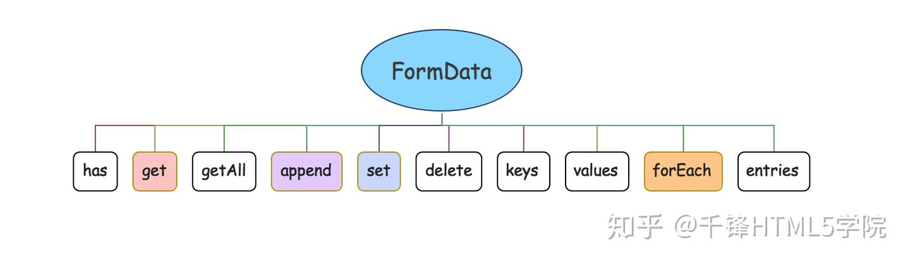

### FormData
```
var formData1 = new FormData();   //空的实例对象
//通过调用对象的方法来设置数据(模拟表单)
//设置数据
formData1.set("name","文顶顶");
formData1.set("email","wendingding_ios@126.com");
formData1.set("friends","熊大");

//设置数据(追加)
formData1.append("friends","光头强");
formData1.append("friends","萝卜头");

//查看实例数据
formData1.forEach(function(value,key){
    console.log(key,value);
})
```

###  form中的应用

```
<form id="formTest" name="formTest" >
    <input type="text" placeholder="请输入用户名" name="user" value="wendingding">
    <input type="password" placeholder="请输入密码" name="pass" value="123456789">
</form>

```
获取
```
//002 获取表单标签传递给FormData构造函数
var formData2 = new FormData(document.getElementById("formTest"))
formData2.forEach(function(value,key){
    console.log(key,value);
})
```

####   注意：表单标签必须要添加name属性才能获取其数据


#### FormData 的主要方法



它提供了一整套的操作数据的方法囊括了添加(set)、修改、查询和删除等操作

append方法和set方法的不同之处在于它不会覆盖而是以数组push的方式来处理同名的数据

formData 对象的keys()、values()和entries()方法使用类似，调用后将得到一个Iterator类型的迭代器对象，该对象能够能够调用next()方法来进行迭代操作，打印结果中的done使用布尔类型的值来进行标记，如果迭代结束那么值为true。

formData 对象的forEach()接收一个回调函数参数，其中第一个参数为当前遍历数据的value值，第二个参数为key(同数组的forEach方法一致)。如果是Ajax发送GET请求，需要通过formData的方式来提交表单数据，那么可以借助该方法来拼接查询字符串。

