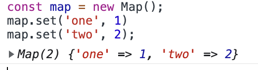
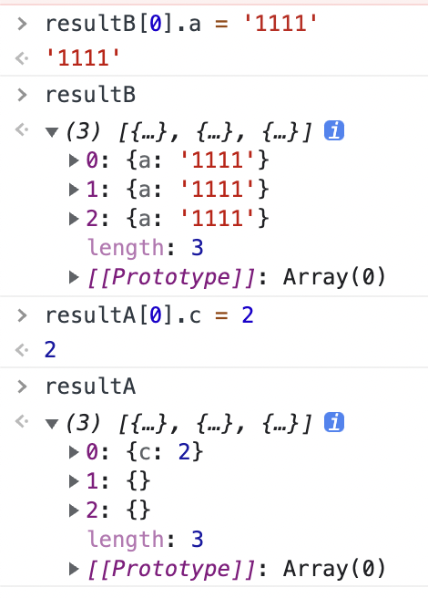

#### Array.from

Array.from() 方法接受类数组对象以及可迭代对象，它可以接受一个 map 函数，并且，这个 map 函数不会跳过值为 undefined 的数值项。这些特性给 Array.from() 提供了很多可能。

#### Array.from 语法

Array.from(arrayLike[, mapFunction[, thisArg]])
```
arrayLike：必传参数，想要转换成数组的伪数组对象或可迭代对象。
mapFunction：可选参数，mapFunction(item，index){...} 是在集合中的每个项目上调用的函数。返回的值将插入到新集合中。
thisArg：可选参数，执行回调函数 mapFunction 时 this 对象。这个参数很少使用。
```

```
const someNumbers = { '0': 10, '1': 15, length: 2 };
Array.from(someNumbers, value => value * 2); // => [20, 30]
```

##### tips

arrayLike 中的length决定 这个对象的value 能显示几个，length 如果超过对象本身的长度，如下，值为NaN

```
  const someNumbers = { '0': 10, '1': 15, length: 3 };
   let result =  Array.from(someNumbers, (value,index)=>{
    console.log(value,'index',index)
    return value*2
   }); // => [20, 30]
   console.log(result)

// result 
10 'index' 0
15 'index' 1
undefined 'index' 2
[20, 30, NaN]

```

### 用途

#### 1.将类数组转换为数组

类数组对象有：函数中的 arguments 关键字，或者是一个 DOM 集合

```
    const someNumbers = { '0': 10, '1': 15, length: 2 };
   let result =  Array.from(someNumbers);
   console.log(result) // [10, 15]
```

对函数的参数求和

```
function sumArguments() {
    return Array.from(arguments).reduce((sum, num) => sum + num);
}
sumArguments(1, 2, 3); // => 6

```

##### tips: Array.from的第一个参数，可以是任何一个可迭代的对象


```
Array.from('Hey');                   // => ['H', 'e', 'y']
Array.from(new Set(['one', 'two'])); // => ['one', 'two']

const map = new Map();
map.set('one', 1)
map.set('two', 2);
Array.from(map); // => [['one', 1], ['two', 2]]
```



#### 2.克隆一个数组
实现浅拷贝

```
const numbers = [3, 6, 9];
const numbersCopy = Array.from(numbers);

numbers === numbersCopy; // => false
```

#### 3.使用值填充数组

如果你需要使用相同的值来初始化数组，那么 Array.from() 将是不错的选择。

我们来定义一个函数，创建一个填充相同默认值的数组：
```
const length = 3;
const init   = 0;
const result = Array.from({ length }, () => init);

result; // => [0, 0, 0]
```


但是，有一个替代方法 array.fill() 可以实现同样的功能。
```
const length = 3;
const init   = 0;
const result = Array(length).fill(init);

```
##### 3.1使用对象填充数组

当初始化数组的每个项都应该是一个新对象时，Array.from() 是一个更好的解决方案：

```
const length = 3;
const resultA = Array.from({ length }, () => ({}));
const resultB = Array(length).fill({});

resultA; // => [{}, {}, {}]
resultB; // => [{}, {}, {}]

resultA[0] === resultA[1]; // => false
resultB[0] === resultB[1]; // => true
```
```
1. 由 Array.from 返回的 resultA 使用不同空对象实例进行初始化。
之所以发生这种情况是因为每次调用时，mapFunction，即此处的 () => ({}) 都会返回一个新的对象。

2. fill() 方法创建的 resultB 使用相同的空对象实例进行初始化。** 不会跳过空项 **
```


3.2 使用array.map 怎么样

```
const length = 3;
const init   = 0;
const result = Array(length).map(() => init);

result; // => [undefined, undefined, undefined]
```
    map() 方法似乎不正常，创建出来的数组不是预期的 [0, 0, 0]，而是一个有3个空项的数组。

    这是因为 Array(length) 创建了一个有3个空项的数组(也称为稀疏数组)，但是 map() 方法会** 跳过空项 **。

#### 4.生成数字范围

你可以使用 Array.from() 生成值范围。例如，下面的 range 函数生成一个数组，从0开始到 end - 1。
```
function range(end) {
    return Array.from({ length: end }, (_, index) => index);
}

range(4); // => [0, 1, 2, 3]
```
在 range() 函数中，Array.from() 提供了类似数组的 {length：end} ，以及一个简单地返回当前索引的 map 函数 。这样你就可以生成值范围。

5.数组的去重

由于 Array.from() 的入参是可迭代对象，因而我们可以利用其与 Set 结合来实现快速从数组中删除重复项。
```
function unique(array) {
  return Array.from(new Set(array));
}

unique([1, 1, 2, 3, 3]); // => [1, 2, 3]

```

首先，new Set(array) 创建了一个包含数组的集合，Set 集合会删除重复项。

因为 Set 集合是可迭代的，所以可以使用 Array.from() 将其转换为一个新的数组。

这样，我们就实现了数组去重。


