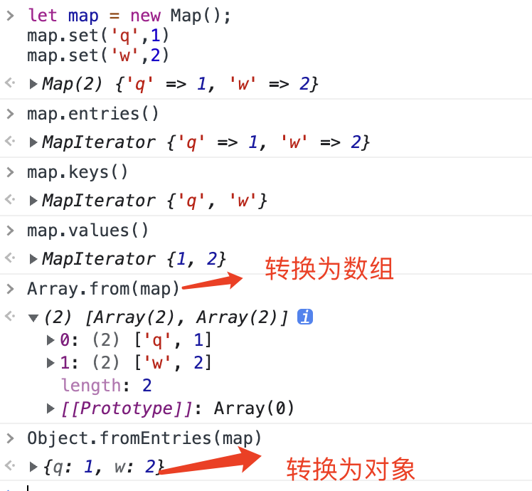
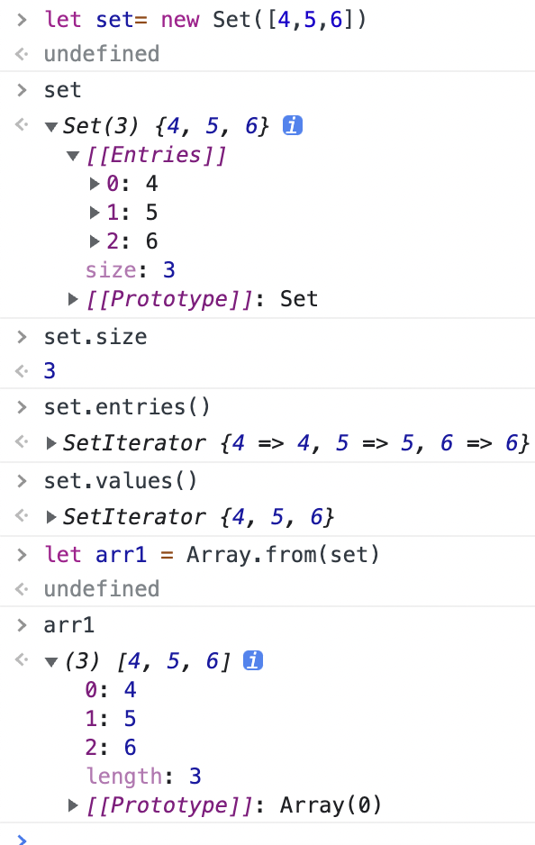

#### 1. Map
```
let map = new Map();
map.set('q',1)
map.set('w',2)
```


创建Map的两种方式
```
1. new Map();map.set('a':1)
2. let map = new Map([
    ['q',1]
])
```
#### 2. Set

```
let set= new Set([4,5,6])
```

