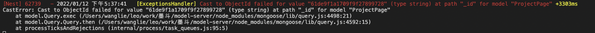

_id 这个字段必须是24个字符，如果传错了 就会报这个错误

```
if (id.match(/^[0-9a-fA-F]{24}$/)) {
  // Yes, it's a valid ObjectId, proceed with `findById` call.
}
```

#### E11000 duplicate key error
```
[Nest] 24637   - 2022/01/20 下午3:01:25   [ExceptionsHandler] E11000 duplicate key error collection: model.Page index: id_1 dup key: { : null } +256438ms
MongoError: E11000 duplicate key error collection: model.Page index: id_1 dup key: { : null }
```
有脏数据了~~~ 去数据库中把脏数据删除即可
