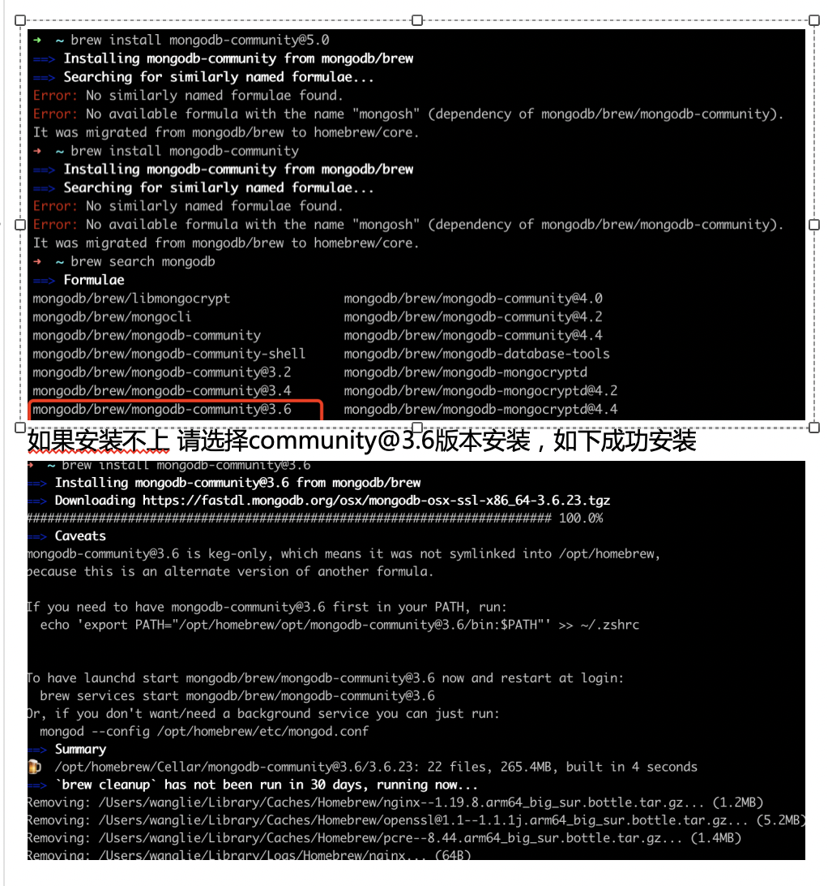

https://docs.mongodb.com/manual/tutorial/install-mongodb-on-os-x/ 安装mongodb




####  启动，关闭


To run MongoDB (i.e. the mongod process) as a macOS service, run:
```
brew services start mongodb-community@5.0
```
To stop a mongod running as a macOS service, use the following command as needed:
```
brew services stop mongodb-community@5.0

```

#### 查询安装的mongodb版本

brew search mongodb


