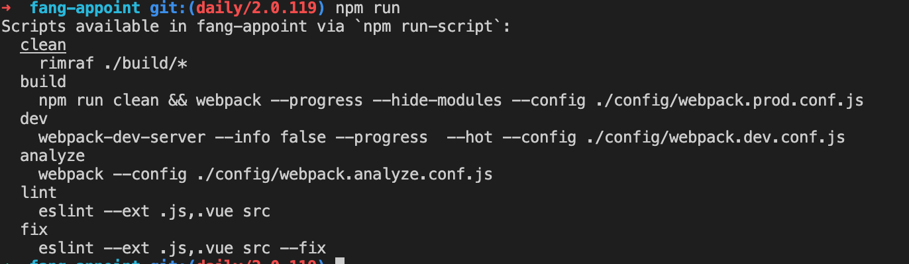

#### 用途

npm ci和npm install命令一样，是用来安装依赖的命令，但他可以比常规的 npm 安装快得多，也比常规安装更严格，他可以保证npm依赖安装的一致和稳定 (锁版本)。
#### 稳定和一致性
npm ci 直接根据 package-lock.json 中指定的版本安装，无需计算求解依赖满足问题，在大多数情况下都可以大大加速 node 模块安装过程。
#### 注意
npm ci 在安装前会自动清除现存的 node_modules，所以 npm ci 天然规避了增量安装可能带来的不一致性等问题。（这也意味着，你又可以少记一条命令 npm prune。）不过，如果你的网络很慢，那可能就不那么妙了。别慌，你可以用 --prefer-offline，最大限度地利用 npm 的全局缓存加速安装过程。


在package.json中，每次install后，对应的版本前都有个 ^ 符号。在这种情况下，你再次install时安装的包的版本可能与前次不一样，具体的，你可以到package-lock.json中查看实际的包版本。

^的匹配规则是：>= 当前版本， “兼容版本号”。匹配到的版本号要大于指定版本号，但是主版本号必须一致。

主版本号 是第一个非零的数字。

举例说明：
```
如：^1.1.2 ，表示>=1.1.2 <2.0.0，可以是1.1.2，1.1.3，…..，1.1.n，1.2.n，…..，1.n.n

如：^0.2.3 ，表示>=0.2.3 <0.3.0，可以是0.2.3，0.2.4，…..，0.2.n

如：^0.0，表示 >=0.0.0 <0.1.0，可以是0.0.0，0.0.1，…..，0.0.n
```
若我们一直使用install命令时，便会遇到开发和测试、发布时包版本不同的问题，这种细微的差别往往会导致严重的结局。

#### 用法
在npm i(install)的地方改用npm ci，当然项目中必须有一个package-lock.json或npm-shrinkwrap.json。

注：npm版本要>=5.7

#### 三、区别
npm ci与npm i主要有以下的区别。

npm i依赖package.json，而npm ci依赖package-lock.json。
当package-lock.json中的依赖于package.json不一致时，npm ci退出但不会修改package-lock.json。
npm ci只可以一次性的安装整个项目依赖，但无法添加单个依赖项。
npm ci安装包之前，会删除掉node_modules文件夹，因此他不需要去校验已下载文件版本与控制版本的关系，也不用校验是否存在最新版本的库，所以下载的速度更快。

#### npm ci命令比npm install命令快2至10倍
npm 5.7.1的发布给我们带了一系列新的功能。

其中我最喜欢的就是npm ci命令了。

npm ci命令

1.npm ci命令只根据lock-file去下载node_modules. 如果你的package.json文件与lock-file不同步，则会抛出错误。

2.每次运行npm ci命令时，它都会删掉你的node_modules文件夹，然后重新下载。

3.它比npm install命令快2至10倍，因为它不必在去比对node_modules中已经下好node_modules进行版本比对。

 

 #####  shrinkwrap锁定依赖
很适用已经发现有版本依赖问题，但还没有生成版本依赖锁的场景。

在项目中执行 npm install 的时候，npm 会检查在根目录下有没有 npm-shrinkwrap.json 文件，如果 shrinkwrap 文件存在的话，npm 会使用它（而不是 package.json）来确定安装的各个包的版本号信息。

shrinkwrap 命令根据目前安装在node_modules的文件情况锁定依赖版本。在开发阶段依赖稳定后，运行如下命令：
```
npm shrinkwrap
npm shrinkwrap--dev//将dev-dependencies计算在内
shrinkwrap会在根目录生成npm-shrinkwrap.json文件。之后的npm install会参照这个文件的版本来安装。
```

注意：

1、在开发依赖稳定后，一定要手动更新shrinkwrap文件。

2、shrinkwrap没有npm版本要求。

3、node_modules文件生成之后，才能生成shrinkwrap文件


#### npm outdated

npm ci 基于 package-lock.json 锁定依赖版本，确保项目开发环境的一致性。但这并不意味着依赖版本是锁死的。为了利用新版本带来的问题修复、新特性以及性能提升，定期还是需要升级依赖版本的。在这一场景下，推荐使用 npm outdated。它会列出还没有升到当前最新版本的项目依赖。红色表示符合指定的语义化版本范围，理论上可以无脑升级（npm update 会一次性升级所有红色依赖）。黄色表示不符合指定的语义化版本范围，比如大版本升级，升级可能会遇到兼容性问题。


有些项目处于维护阶段，不打算加新特性了，甚至可能不太严重的问题都不打算修复了，但是像安全漏洞这样的严重问题还是要管的。这时可以使用 npm audit 命令，列出项目依赖中有安全漏洞的版本。处于活跃开发阶段的项目当然也需要关注安全漏洞问题，但是因为 npm install 引入新依赖时会自动运行 npm audit，再加上会定期运行 npm outdated，所以手动运行 npm audit 的机会不太多。


#### npx
```
npm i -D webpack
npx webpack ...
```
这里 i -D 是 install --save-dev 的简写形式。

对于一些一次性的临时任务，可以直接通过 npx 运行相应工具，免去了手动安装的麻烦，也不会污染 devDependencies。

例如，之前项目使用 webpack 打包，现在想临时试下换用 rollup 打包的效果：
```
npx rollup ...
```
npx 很智能，如果路径中找不到 rollup，会自动安装。

当前使用的是 node 的 LTS 版本（10），想试下 node 12 下构建脚本能不能跑起来：
```
npx -p node@12 npm run build
```
从上面我们可以看到，当包名和命令名不同时（npm 命令由 node 提供），可以用 -p 选项指定包名。


### npm run

在 package.json 的 scripts 属性中加入命令（例如："foo": "echo foo"）就可以通过 npm run foo 运行对应命令。

直接运行 npm run （不带任何参数）会列出所有在 scripts 中声明的命令




#### 小窍门

npm init -y 默认情况下，npm init 会让你回答一些问题。npm init -y 可以跳过这些问题，直接上手开发。


