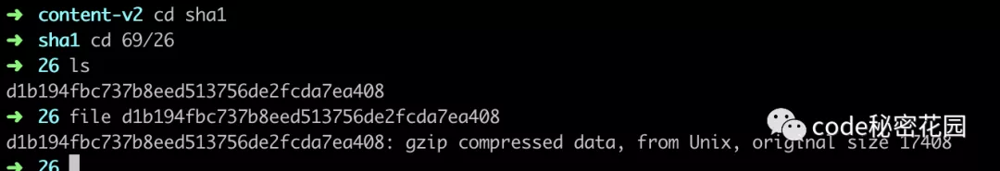

<image src="https://mmbiz.qpic.cn/mmbiz_png/aDoYvepE5x07V71lB2Paq6xf9EexnFcVD240SNZBLIwLogx4AEue7BLFeSSglH5MFk8oAtkMznOZRatVjugofg/640?wx_fmt=png&tp=webp&wxfrom=5&wx_lazy=1&wx_co=1">


#### https://mp.weixin.qq.com/s?__biz=Mzg2NDAzMjE5NQ==&mid=2247485074&idx=1&sn=a4b39ef1fcad427e79a8714c41b8eb0b&chksm=ce6ec23ef9194b28cd007f4de1691a27ecb4742a510fb118beb37e611ed4ec211b15f74d16a6&scene=21#wechat_redirect


#### 整体流程
<image src="./img/">
#### 缓存

在执行 npm install 或 npm update命令下载依赖后，除了将依赖包安装在node_modules 目录下外，还会在本地的缓存目录缓存一份。

通过 npm config get cache 命令可以查询到：在 Linux 或 Mac 默认是用户主目录下的 .npm/_cacache 目录。


在这个目录下又存在两个目录：content-v2、index-v5，content-v2 目录用于存储 tar包的缓存，而index-v5目录用于存储tar包的 hash。


npm 在执行安装时，可以根据 package-lock.json 中存储的 integrity、version、name 生成一个唯一的 key 对应到 index-v5 目录下的缓存记录，从而找到 tar包的 hash，然后根据 hash 再去找缓存的 tar包直接使用。

我们可以找一个包在缓存目录下搜索测试一下，在 index-v5 搜索一下包路径：

grep "https://registry.npmjs.org/base64-js/-/base64-js-1.0.1.tgz" -r index-v5

然后我们将json格式化：

```
{
  "key": "pacote:version-manifest:https://registry.npmjs.org/base64-js/-/base64-js-1.0.1.tgz:sha1-aSbRsZT7xze47tUTdW3i/Np+pAg=",
  "integrity": "sha512-C2EkHXwXvLsbrucJTRS3xFHv7Mf/y9klmKDxPTE8yevCoH5h8Ae69Y+/lP+ahpW91crnzgO78elOk2E6APJfIQ==",
  "time": 1575554308857,
  "size": 1,
  "metadata": {
    "id": "base64-js@1.0.1",
    "manifest": {
      "name": "base64-js",
      "version": "1.0.1",
      "engines": {
        "node": ">= 0.4"
      },
      "dependencies": {},
      "optionalDependencies": {},
      "devDependencies": {
        "standard": "^5.2.2",
        "tape": "4.x"
      },
      "bundleDependencies": false,
      "peerDependencies": {},
      "deprecated": false,
      "_resolved": "https://registry.npmjs.org/base64-js/-/base64-js-1.0.1.tgz",
      "_integrity": "sha1-aSbRsZT7xze47tUTdW3i/Np+pAg=",
      "_shasum": "6926d1b194fbc737b8eed513756de2fcda7ea408",
      "_shrinkwrap": null,
      "bin": null,
      "_id": "base64-js@1.0.1"
    },
    "type": "finalized-manifest"
  }
}
```

上面的 _shasum 属性 6926d1b194fbc737b8eed513756de2fcda7ea408 即为 tar 包的 hash， hash的前几位 6926 即为缓存的前两层目录，我们进去这个目录果然找到的压缩后的依赖包：



#### npm 提供了几个命令来管理缓存数据：

npm cache add：官方解释说这个命令主要是 npm 内部使用，但是也可以用来手动给一个指定的 package 添加缓存。

npm cache clean：删除缓存目录下的所有数据，为了保证缓存数据的完整性，需要加上 --force 参数。

npm cache verify：验证缓存数据的有效性和完整性，清理垃圾数据。

基于缓存数据，npm 提供了离线安装模式，分别有以下几种：

--prefer-offline：优先使用缓存数据，如果没有匹配的缓存数据，则从远程仓库下载。

--prefer-online：优先使用网络数据，如果网络数据请求失败，再去请求缓存数据，这种模式可以及时获取最新的模块。

--offline：不请求网络，直接使用缓存数据，一旦缓存数据不存在，则安装失败。


