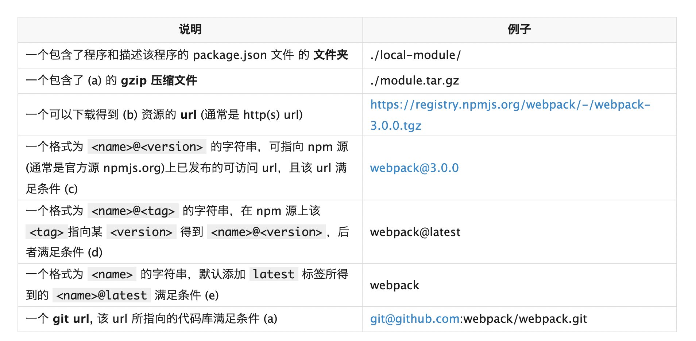

#### package 包的定义

我们都知道要手动安装一个包时，执行 npm install `<package>` 命令即可。这里的第三个参数 package 通常就是我们所要安装的包名，默认配置下 npm 会从默认的源 (Registry) 中查找该包名对应的包地址，并下载安装。但在 npm 的世界里，除了简单的指定包名, package 还可以是一个指向有效包名的 http url/git url/文件夹路径。

阅读 npm的文档， 我们会发现package 准确的定义，只要符合以下其中之一条件，就是一个 package:


#### 场景1: 本地模块引用

nodejs 应用开发中不可避免有模块间调用，例如在实践中经常会把需要被频繁引用的配置模块放到应用根目录；于是在创建了很多层级的目录、文件后，很可能会遇到这样的代码:

```
const config = require('../../../../config.js');
```
除了看上去很丑以外，这样的路径引用也不利于代码的重构。并且身为程序员的自我修养告诉我们，这样重复的代码多了也就意味着是时候把这个模块分离出来供应用内其他模块共享了。例如这个例子里的 config.js 非常适合封装为 package 放到 node_modules 目录下，共享给同应用内其他模块。

无需手动拷贝文件或者创建软链接到 node_modules 目录，npm 有更优雅的解决方案。


#### 方案：

1: 创建 config 包:
新增 config 文件夹; 重命名 config.js 为 config/index.js 文件; 创建 package.json 定义 config 包
```
{
    "name": "config",
    "main": "index.js",
    "version": "1.0.0"
}
```
2: 在应用层 package.json 文件中新增依赖项，然后执行 npm install; 或直接执行第 3 步
```
{
    "dependencies": {
        "config": "file:./config"
    }
}
````
3: （等价于第 2 步）直接在应用目录执行
```
 npm install file:./config
 ````

 此时，查看 node_modules 目录我们会发现多出来一个名为 config，指向上层 config/ 文件夹的软链接。这是因为 npm 识别 file: 协议的url，得知这个包需要直接从文件系统中获取，会自动创建软链接到 node_modules 中，完成“安装”过程。

相比手动软链，我们既不需要关心 windows 和 linux 命令差异，又可以显式地将依赖信息固化到 dependencies 字段中，开发团队其他成员可以执行 npm install 后直接使用。


#### 安装git仓库包

有些时候，我们一个团队内会有一些代码/公用库需要在团队内不同项目间共享，但可能由于包含了敏感内容，或者代码太烂拿不出手等原因，不方便发布到源。

这种情况下，我们可以简单地将被依赖的包托管在私有的 git 仓库中，然后将该 git url 保存到 dependencies 中. npm 会直接调用系统的 git 命令从 git 仓库拉取包的内容到 node_modules 中。

#### npm 支持的 git url 格式:

```

<protocol>://[<user>[:<password>]@]<hostname>[:<port>][:][/]<path>[#<commit-ish> | #semver:<semver>]

```

git 路径后可以使用 # 指定特定的 git branch/commit/tag, 也可以 #semver: 指定特定的 semver range.

```
git
git+ssh
git+http
git+https
git+file.

```
例如：
```
git+ssh://git@github.com:npm/npm.git#v1.2.0
git+ssh://git@github.com:npm/npm#sm:^4.0
git+https://isaacs@github.com/npm/npm.git
git://github.com/npm/npm.git#v6.0.27

```

#### 场景3: 开源 package 问题修复

使用某个 npm 包时发现它有某个严重bug，但也许最初作者已不再维护代码了，也许我们工作紧急，没有足够的时间提 issue 给作者再慢慢等作者发布新的修复版本到 npm 源。

此时我们可以手动进入 node_modules 目录下修改相应的包内容，也许修改了一行代码就修复了问题。但是这种做法非常不明智！

首先 node_modules 本身不应该放进版本控制系统，对 node_modules 文件夹中内容的修改不会被记录进 git 提交记录；其次，就算我们非要反模式，把 node_modules 放进版本控制中，你的修改内容也很容易在下次 team 中某位成员执行 npm install 或 npm update 时被覆盖，而这样的一次提交很可能包含了几十几百个包的更新，你自己所做的修改很容易就被淹没在庞大的 diff 文件列表中了。

#### 方案:

最好的办法应当是 fork 原作者的 git 库，在自己所属的 repo 下修复问题后，将 dependencies 中相应的依赖项更改为自己修复后版本的 git url 即可解决问题。（Fork 代码库后，也便于向原作者提交 PR 修复问题。上游代码库修复问题后，再次更新我们的依赖配置也不迟。）


#### 区分不同registry

这里有个区分不同registry的方法，在用户根目录下建立.npmrc，其中内容：
```
1 registry=https://registry.npm.taobao.org/
2 @xxx:registry=http://registry.npm.xxx.com
```
那么，在package.json中以"@xxx/xxx": ""方式书写的package都会使用不同的仓库。

