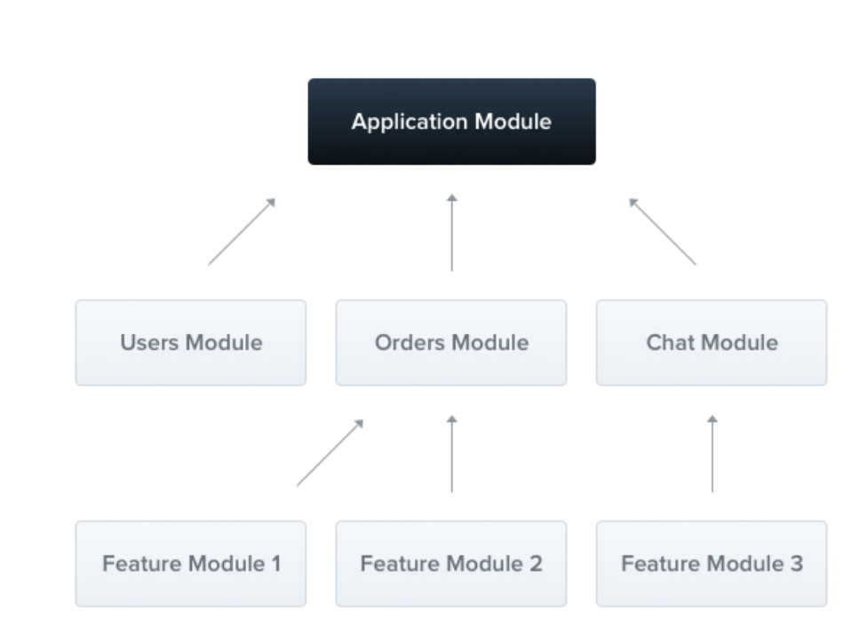

模块是具有 @Module() 装饰器的类。 @Module() 装饰器提供了元数据，Nest 用它来组织应用程序结构。


每个 Nest 应用程序至少有一个模块，即根模块。根模块是 Nest 开始安排应用程序树的地方。事实上，根模块可能是应用程序中唯一的模块，特别是当应用程序很小时，但是对于大型程序来说这是没有意义的。在大多数情况下，您将拥有多个模块，每个模块都有一组紧密相关的功能。

#### @module() 装饰器接受一个描述模块属性的对象：

|       |  |
| ----------- | ----------- |
| providers      | 由 Nest 注入器实例化的提供者，并且可以至少在整个模块中共享       |
| controllers   | 必须创建的一组控制器        |
| imports | 导入模块的列表，这些模块导出了此模块中所需提供者 |
| exports | 由本模块提供并应在其他模块中可用的提供者的子集。 |

默认情况下，该模块封装提供程序。这意味着无法注入既不是当前模块的直接组成部分，也不是从导入的模块导出的提供程序。因此，您可以将从模块导出的提供程序视为模块的公共接口或API。

### 功能模块

CatsController 和 CatsService 属于同一个应用程序域。 应该考虑将它们移动到一个功能模块下，即 CatsModule。

```
// cats/cats.module.ts
import { Module } from '@nestjs/common';
import { CatsController } from './cats.controller';
import { CatsService } from './cats.service';

@Module({
  controllers: [CatsController],
  providers: [CatsService],
})
export class CatsModule {}

```
#### 要使用 CLI 创建模块，只需执行 $ nest g module cats 命令。

```
 // cats/cats.module.ts

import { Module } from '@nestjs/common';
import { CatsController } from './cats.controller';
import { CatsService } from './cats.service';

@Module({
  controllers: [CatsController],
  providers: [CatsService],
})
export class CatsModule {}

//app.module.ts

import { Module } from '@nestjs/common';
import { CatsModule } from './cats/cats.module';

@Module({
  imports: [CatsModule],
})
export class ApplicationModule {}
```

现在 Nest 知道除了 ApplicationModule 之外，注册 CatsModule 也是非常重要的。 这就是我们现在的目录结构:
```
src
├──cats
│    ├──dto
│    │   └──create-cat.dto.ts
│    ├──interfaces
│    │     └──cat.interface.ts
│    ├─cats.service.ts
│    ├─cats.controller.ts
│    └──cats.module.ts
├──app.module.ts
└──main.ts
```


### 共享模块

实际上，每个模块都是一个共享模块。一旦创建就能被任意模块重复使用。假设我们将在几个模块之间共享 CatsService 实例。 我们需要把 CatsService 放到 exports 数组中，如下所示

```
// cats.module.ts

import { Module } from '@nestjs/common';
import { CatsController } from './cats.controller';
import { CatsService } from './cats.service';

@Module({
  controllers: [CatsController],
  providers: [CatsService],
  exports: [CatsService]
})
export class CatsModule {}

```

现在，每个导入 CatsModule 的模块都可以访问 CatsService ，并且它们将共享相同的 CatsService 实例。


### 依赖注入

提供者也可以注入到模块(类)中（例如，用于配置目的）：
```
cats.module.ts

import { Module } from '@nestjs/common';
import { CatsController } from './cats.controller';
import { CatsService } from './cats.service';

@Module({
  controllers: [CatsController],
  providers: [CatsService],
})
export class CatsModule {
  constructor(private readonly catsService: CatsService) {} // 注入
}
```

但是，由于循环依赖性，模块类不能注入到提供者中。


#### 全局模块

如果你不得不在任何地方导入相同的模块，那可能很烦人。在 Angular 中，提供者是在全局范围内注册的。一旦定义，他们到处可用。另一方面，Nest 将提供者封装在模块范围内。您无法在其他地方使用模块的提供者而不导入他们。但是有时候，你可能只想提供一组随时可用的东西 - 例如：helper，数据库连接等等。这就是为什么你能够使模块成为全局模块。
```
import { Module, Global } from '@nestjs/common';
import { CatsController } from './cats.controller';
import { CatsService } from './cats.service';

@Global() // 使此模块成为全局作用域
@Module({
  controllers: [CatsController],
  providers: [CatsService],
  exports: [CatsService],
})
export class CatsModule {}
```
@Global 装饰器使模块成为全局作用域。 全局模块应该只注册一次，最好由根或核心模块注册。 在上面的例子中，CatsService 组件将无处不在，而想要使用 CatsService 的模块则不需要在 imports 数组中导入 CatsModule。

### 注意： 使一切全局化并不是一个好的解决方案。 全局模块可用于减少必要模板文件的数量。 imports 数组仍然是使模块 API 透明的最佳方式。

#### 动态模块