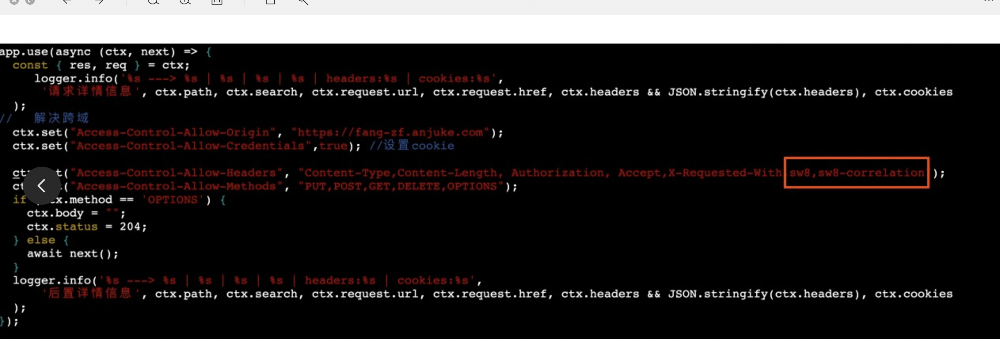

```
app.use(function (req, res, next) {
    // 解决跨域
    res.setHeader("Access-Control-Allow-Origin", "http://localhost:8080");
    res.setHeader("Access-Control-Allow-Credentials",true); //设置cookie

    res.setHeader("Access-Control-Allow-Headers", "Content-Type,Content-Length, Authorization, Accept,X-Requested-With");
    res.setHeader("Access-Control-Allow-Methods", "PUT,POST,GET,DELETE,OPTIONS");
    res.setHeader("X-Powered-By", ' 3.2.1');
    if (req.method == "OPTIONS") return res.end(); /*让options请求快速返回*/
    else next();
});
```

