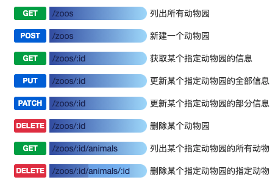

#### 如何设计一个RESTful API结构的系统呢。
URI里面使用的是名词而且不是动词，推荐使用复数，通过HTTP动词来实现资源的跳转。
错误的
```
/getOrders
listCitys
/getWeathers?city=深圳
```
正确的
```
GET /orders/1 ：返回订单编号为1的订单
POST /orders ：增加一个订单
Delete /orders/1 ：删除一个订单编号为1的订单
PUT /orders/1 :更新订单编号为1的订单
```
保证方法里面只做一件事，不会对资源状态有所改变。比如下面这样是不允许的
```
GET /updateOrder?id=1
```
使用正确的HTTP Status Code 表示返回的请求状态。比如
```
{"code":"200"}
```
以上就是如何设计一个简单的RESTful API结构系统的示例。