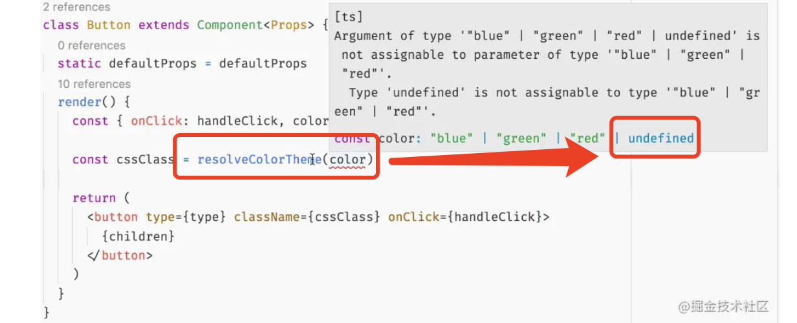

https://juejin.cn/post/6844903854107000845



#### 怎么修复这个价值很高的问题呢？

TypeScript 2.9 中提供了 4 中方法修复它：

```
非空断言语句（Non-null assertion operator）
组件类型重置（Component type casting）
高阶组件定义 defaultProps
Props getter 函数
```
#### 1. 非空断言语句
这个方法是显而易见的，就是明确告诉类型检查器，这不会是 null 或者 undefined，通过!操作符实现：

```
const cssClass = resolveColorTheme(color!)
// OR
const color = this.props.color!;
const cssClass = resolveColorTheme(color)
```
缺点：
对于简单的用例（props 属性很少的，仅在 render 方法接受特定的 props 的用例）这样做没问题的，随着业务的增长，这样的方法会加剧你组件的混乱，不可读。你需要花费大量时间检查哪个 props 被定义为 defaultProps，占用了开发者大量时间，这样也容易导致错误


