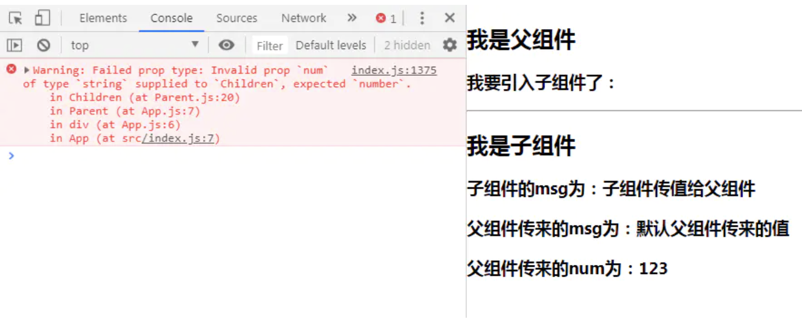

#### 一、defaultProps
如果父组件在调用子组件时，没有给子组件传值，子组件使用的就是defaultProps里定义的默认值。

用法：

在定义组件Children之后，在export之前
组件名.defaultProps = 对象
对象里键为对应的要指定初始值的属性名，值就为要定义的默认值。


##### 二、propTypes
用来验证父组件传值的合法性。

步骤：

父组件的state加一个num: '123'
父组件调用子组件时把值传过去<Children num={ this.state.num } />
子组件中引入PropTypes import propTypes from 'prop-types'
在定义组件Children之后，export之前加入：组件名.propTypes = { 属性名: propTypes.要求的类型 }如Children.propTypes = { num: propTypes.number }


例子

#### parent
```
import React, {Component} from 'react'
import Children from './Children'

export default class Parent extends Component {
    constructor(props) {
        super(props)
        this.state = {
            name: '我是父组件',
            msg: '父组件传值给子组件',
            num: '123'
        }
    }

    render() {
        return (
            <div>
                <h2>{ this.state.name }</h2>
                <h3>我要引入子组件了：</h3>
                <hr/>
                <Children num={ this.state.num } />
            </div>
        )
    }
}
```

#### children
```
import React, {Component} from 'react'
import propTypes from 'prop-types'

class Children extends Component {
    constructor(props) {
        super(props)
        this.state = {
            name: '我是子组件',
            msg: '子组件传值给父组件'
        }
    }

    render() {
        return (
            <div>
                <h2>{this.state.name}</h2>
                <h3>子组件的msg为：{this.state.msg}</h3>
                <h3>父组件传来的msg为：{this.props.msg}</h3>
                <h3>父组件传来的num为：{this.props.num}</h3>
            </div>
        )
    }
}

// defaultProps
Children.defaultProps = {
    msg: '默认父组件传来的值'
}
// PropTypes
Children.propTypes = {
    num: propTypes.number
}

export default Children
```
#### 报错如下

