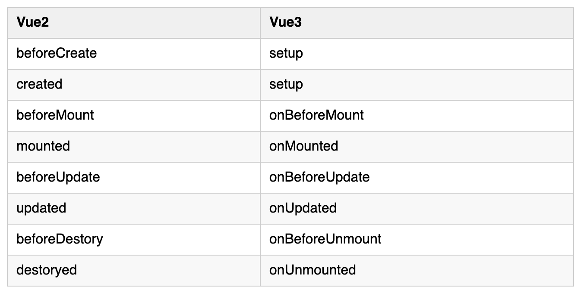

https://mp.weixin.qq.com/s/IIs3JJZTjJhTmmoSwXb9Cw





Vue3的这些生命周期调用也很简单，同样是先从 vue 中导入，再进行直接调用

```
<template>
  <div id="app"></div>
</template>

<script>
// 1. 从 vue 中引入 多个生命周期函数
import {onBeforeMount, onMounted, onBeforeUpdate, onUpdated, onBeforeUnmount, unMounted} from 'vue'
export default {
  name: 'App',
  setup() {
      onBeforeMount(() => {
          // 在挂载前执行某些代码
      })

      onMounted(() => {
          // 在挂载后执行某些代码
      })

      onBeforeUpdate(() => {
          // 在更新前前执行某些代码
      })

      onUpdated(() => {
          // 在更新后执行某些代码
      })

      onBeforeUnmount(() => {
          // 在组件销毁前执行某些代码
      })

      unMounted(() => {
          // 在组件销毁后执行某些代码
      })

      return {}
  }
  
}
</script>

```

（3）reactive

reactive 方法是用来创建一个响应式的数据对象，该API也很好地解决了Vue2通过 defineProperty 实现数据响应式的缺陷

reactive 接收对象和Arr类型，而普通值类型 不能够实现双向绑定

   -- Proxy 对象用于创建一个对象的代理，从而实现基本操作的拦截和自定义（如属性查找、赋值、枚举、函数调用等）
用法

很简单，只需将数据作为参数传入即可，代码如下
```
<template>
  <div id="app">
   <!-- 4. 访问响应式数据对象中的 count  -->
   {{count}}
  </div>
</template>

<script>
// 1. 从 vue 中导入 reactive 
import {reactive} from 'vue'
export default {
  name: 'App',
  setup() {
      // 2. 创建响应式的数据对象
      const state = reactive({count: 3})

      // 3. 将响应式数据对象state return 出去，供template使用
      return {state}
  }
}
</script>
```

（4）ref

ref 跟 reactive 都是响应系统的核心方法，作为整个系统的入口

##### 可以将 ref 看成 reactive 的一个变形版本，这是由于 reactive 内部采用 Proxy 来实现，而 Proxy 只接受对象作为入参，这才有了 ref 来解决值类型的数据响应，如果传入 ref 的是一个对象，内部也会调用 reactive 方法进行深层响应转换

#### Ref 是如何创建的
我们还是先从定义抓起，ref 接收一个可选的 unknown 做为入参，接着直接调用 createRef

createRef 先判断 value 是否已经是一个 ref, 如果是则直接返回，如果不是接着判断是不是浅观察，如果是浅观察直接构造一个 ref 返回，不是则将 rawValue 转换成 reactive 再构造一个 ref 返回

#### ref
     *  接受一个参数值并返回一个响应式且可改变的 ref 对象。ref 对象拥有一个指向内部值的单一属性 .value。

在介绍 setup 函数时，我们使用了 ref 函数包装了一个响应式的数据对象，这里表面上看上去跟 reactive 好像功能一模一样啊，确实差不多，因为 ref 就是通过 reactive 包装了一个对象 ，然后是将值传给该对象中的 value 属性，这也就解释了为什么每次访问时我们都需要加上 .value

```
const count = ref(0)
console.log(count.value) // 0

count.value++
console.log(count.value) // 1
```

我们可以简单地把 ref(obj) 理解为这个样子 reactive({value: obj})

这里我们写一段代码来具体看一下
```
<script>
import {ref, reactive} from 'vue'
export default {
  name: 'App',
  setup() {
      const obj = {count: 3}
      const state1 = ref(obj)
      const state2 = reactive(obj)

      console.log(state1)
      console.log(state2)
  }
  
}
</script>
```


### 注意： 这里指的 .value 是在 setup 函数中访问 ref 包装后的对象时才需要加的，在 template 模板中访问时是不需要的，因为在编译时，会自动识别其是否为 ref 包装过的

那么我们到底该如何选择 ref 和 reactive 呢？

建议：

基本类型值（String 、Nmuber 、Boolean 等）或单值对象（类似像 {count: 3} 这样只有一个属性值的对象）使用 ref
引用类型值（Object 、Array）使用 reactive

（5）toRef

toRef 是将某个对象中的某个值转化为响应式数据，其接收两个参数，第一个参数为 obj 对象；第二个参数为对象中的属性名


例如使用父组件传递的props数据时，要引用props的某个属性且要保持响应式连接时就很有用。

toRef后的ref数据不是原始数据的拷贝，而是引用，改变结果数据的值也会同时改变原始数据
```
<script>
// 1. 导入 toRef
import {toRef} from 'vue'
export default {
    setup() {
        const obj = {count: 3}
        // 2. 将 obj 对象中属性count的值转化为响应式数据
        const state = toRef(obj, 'count')

        // 3. 将toRef包装过的数据对象返回供template使用
        return {state}
    }
}
</script>
```

####  总结：

ref 是对传入数据的拷贝；toRef 是对传入数据的引用
ref 的值改变会更新视图；toRef 的值改变不会更新视图


（6）toRefs
了解完 toRef 后，就很好理解 toRefs 了，其作用就是将传入的对象里所有的属性的值都转化为响应式数据对象，该函数支持一个参数，即 obj 对象

##### toRefs 用于将响应式对象转换为结果对象，其中结果对象的每个属性都是指向原始对象相应属性的ref。常用于es6的解构赋值操作，因为在对一个响应式对象直接解构时解构后的数据将不再有响应式，而使用toRefs可以方便解决这一问题。

* 获取数据值的时候需要加.value
toRefs后的ref数据不是原始数据的拷贝，而是引用，改变结果数据的值也会同时改变原始数据
作用其实和 toRef 类似，只不过 toRef 是一个个手动赋值，而 toRefs 是自动赋值。

我们来看一下它的基本使用

```
import { defineComponent, toRefs } from 'vue'

export default defineComponent({
  props: [title],
  
  setup (props) {
    // 使用了解构赋值语法创建了变量myTitle
    const { myTitle } = toRefs(props)

    console.log(myTitle.value)
  }
})

```

（7）shallowReactive

听这个API的名称就知道，这是一个浅层的 reactive，难道意思就是原本的 reactive 是深层的呗，没错，这是一个用于性能优化的API

shallowReactive 监听了第一层属性的值，一旦发生改变，则更新视图

（8）shallowRef

这是一个浅层的 ref，与 shallowReactive 一样是拿来做性能优化的

shallowReactive 是监听对象第一层的数据变化用于驱动视图更新，那么 shallowRef 则是监听 .value 的值的变化来更新视图的

改个数据还要重新赋值，不要担心，此时我们可以用到另一个API，叫做 triggerRef ，调用它就可以立马更新视图，其接收一个参数 state ，即需要更新的 ref 对象


（9）toRaw

toRaw 方法是用于获取 ref 或 reactive 对象的原始数据的

先来看一段代码

```
<template>
 <p>{{ state.name }}</p>
 <p>{{ state.age }}</p>
 <button @click="change">改变</button>
</template>

<script>
import {reactive} from 'vue'
export default {
    setup() {
        const obj = {
            name: '前端印象',
            age: 22
        }

        const state = reactive(obj) 

        function change() {
            state.age = 90
            console.log(obj); // 打印原始数据obj
            console.log(state);  // 打印 reactive对象
        }

        return {state, change}
    }
}
</script>
```

##### 我们改变了 reactive 对象中的数据，于是看到原始数据 obj 和被 reactive 包装过的对象的值都发生了变化，由此我们可以看出，这两者是一个引用关系

那么此时我们就想了，那如果直接改变原始数据 obj 的值，会怎么样呢？答案是：reactive 的值也会跟着改变，但是视图不会更新

由此可见，当我们想修改数据，但不想让视图更新时，可以选择直接修改原始数据上的值，因此需要先获取到原始数据，我们可以使用 Vue3 提供的 toRaw 方法


toRaw 接收一个参数，即 ref 对象或 reactive 对象

```
<script>
import {reactive, toRaw} from 'vue'
export default {
    setup() {
        const obj = {
            name: '前端印象',
            age: 22
        }

        const state = reactive(obj) 
        const raw = toRaw(state)

        console.log(obj === raw)   // true
    }
}
</script>
```

上述代码就证明了 toRaw 方法从 reactive 对象中获取到的是原始数据，因此我们就可以很方便的通过修改原始数据的值而不更新视图来做一些性能优化了

（10）markRaw (raw  [rɔː] 原始的)

markRaw 方法可以将原始数据标记为非响应式的，即使用 ref 或 reactive 将其包装，仍无法实现数据响应式，其接收一个参数，即原始数据，并返回被标记后的数据


11）provide && inject
与 Vue2中的 provide 和 inject 作用相同，只不过在Vue3中需要手动从 vue 中导入

这里简单说明一下这两个方法的作用：

provide ：向子组件以及子孙组件传递数据。接收两个参数，第一个参数是 key，即数据的名称；第二个参数为 value，即数据的值
inject ：接收父组件或祖先组件传递过来的数据。接收一个参数 key，即父组件或祖先组件传递的数据名称
假设这有三个组件，分别是 A.vue 、B.vue 、C.vue，其中 B.vue 是 A.vue 的子组件，C.vue 是 B.vue 的子组件

```
// A.vue
<script>
import {provide} from 'vue'
export default {
    setup() {
        const obj= {
            name: '前端印象',
            age: 22
        }

        // 向子组件以及子孙组件传递名为info的数据
        provide('info', obj)
    }
}
</script>

// B.vue
<script>
import {inject} from 'vue'
export default {
    setup() { 
        // 接收A.vue传递过来的数据
        inject('info')  // {name: '前端印象', age: 22}
    }
}
</script>

// C.vue
<script>
import {inject} from 'vue'
export default {
    setup() { 
        // 接收A.vue传递过来的数据
        inject('info')  // {name: '前端印象', age: 22}
    }
}
</script>
```


（12）watch && watchEffect

watch 和 watchEffect 都是用来监视某项数据变化从而执行指定的操作的，但用法上还是有所区别

watch：watch( source, cb, [options] )

参数说明：

source：可以是表达式或函数，用于指定监听的依赖对象
cb：依赖对象变化后执行的回调函数
options：可参数，可以配置的属性有 immediate（立即触发回调函数）、deep（深度监听）

因为 watch 方法的第一个参数我们已经指定了监听的对象，因此当组件初始化时，不会执行第二个参数中的回调函数，若我们想让其初始化时就先执行一遍，可以在第三个参数对象中设置 immediate: true


watch 方法默认是浅层的监听我们指定的数据，例如如果监听的数据有多层嵌套，深层的数据变化不会触发监听的回调，若我们想要其对深层数据也进行监听，可以在第三个参数对象中设置 deep: true

补充： watch方法会返回一个stop方法，若想要停止监听，便可直接执行该stop函数

```
import {reactive, watch} from 'vue'
export default {
  setup() {
    // watch可以手动停止监听
    const state = reactive({obj: {name: '张三'}})
    const stop = watch(
      () => state.obj.name,
      (newVal, oldVal) => {
        console.log(`原始值：${oldVal}`);
        console.log(`最新值：${newVal}`);
      },
      {deep: true}
    )
    setTimeout(() => {
      state.obj.name = '李四'
    }, 1000);
    return {state, stop}
  }

```

接下来再来聊聊 watchEffect，它与 watch 的区别主要有以下几点：

不需要手动传入依赖
每次初始化时会执行一次回调函数来自动获取依赖
无法获取到原值，只能得到变化后的值

```
import {reactive, watchEffect} from 'vue'
export default {
  setup() {
    const state = reactive({
      name: '张三',
      age: 20
    })
    watchEffect(() => {
      console.log(`姓名：${state.name}`);
      console.log(`年龄：${state.age}`);
    })
    setTimeout(() => {
      state.name = '李四'
      state.age = 30
    }, 1000);
    return {state}
  }
}
```

组件初始化时，将该回调函数执行一次，自动获取到需要检测的数据是state.name和state.age

(13）getCurrentInstance
我们都知道在Vue2的任何一个组件中想要获取当前组件的实例可以通过 this 来得到，而在Vue3中我们大量的代码都在 setup 函数中运行，并且在该函数中 this 指向的是 undefined，那么该如何获取到当前组件的实例呢？

```
<template>
 <p>{{ num }}</p>
</template>
<script>
import {ref, getCurrentInstance} from 'vue'
export default {
    setup() { 
        const num = ref(3)
        const instance = getCurrentInstance()
        console.log(instance)

        return {num}
    }
}
</script>
```

看一下 ctx 和 proxy，因为这两个才是我们想要的 this 的内容


可以看到 ctx 和 proxy 的内容十分类似，只是后者相对于前者外部包装了一层 proxy，由此可说明 proxy 是响应式的

（14）useStore

在Vue2中使用 Vuex，我们都是通过 this.$store 来与获取到Vuex实例，但上一部分说了原本Vue2中的 this 的获取方式不一样了，并且我们在Vue3的 getCurrentInstance().ctx 中也没有发现 $store 这个属性，那么如何获取到Vuex实例呢？这就要通过 vuex 中的一个方法了，即 useStore

```
// store 文件夹下的 index.js
import Vuex from 'vuex'

const store = Vuex.createStore({
    state: {
        name: '前端印象',
        age: 22
    },
    mutations: {
        ……
    },
    ……
})

// example.vue
<script>
// 从 vuex 中导入 useStore 方法
import {useStore} from 'vuex'
export default {
    setup() { 
        // 获取 vuex 实例
        const store = useStore()

        console.log(store)
    }
}
</script>

```


然后接下来就可以像之前一样正常使用 vuex 了


（15）获取标签元素

最后再补充一个 ref 另外的作用，那就是可以获取到标签元素或组件

在Vue2中，我们获取元素都是通过给元素一个 ref 属性，然后通过 this.$refs.xx 来访问的，但这在Vue3中已经不再适用了

接下来看看Vue3中是如何获取元素的吧

```
<template>
  <div>
    <div ref="el">div元素</div>
  </div>
</template>

<script>
import { ref, onMounted } from 'vue'
export default {
  setup() {
      // 创建一个DOM引用，名称必须与元素的ref属性名相同
      const el = ref(null)

      // 在挂载后才能通过 el 获取到目标元素
      onMounted(() => {
        el.value.innerHTML = '内容被修改'
      })

      // 把创建的引用 return 出去
      return {el}
  }
}
</script>

```

获取元素的操作一共分为以下几个步骤：

先给目标元素的 ref 属性设置一个值，假设为 el
然后在 setup 函数中调用 ref 函数，值为 null，并赋值给变量 el，这里要注意，该变量名必须与我们给元素设置的 ref 属性名相同
把对元素的引用变量 el 返回（return）出去

#### 补充：设置的元素引用变量只有在组件挂载后才能访问到，因此在挂载前对元素进行操作都是无效的


