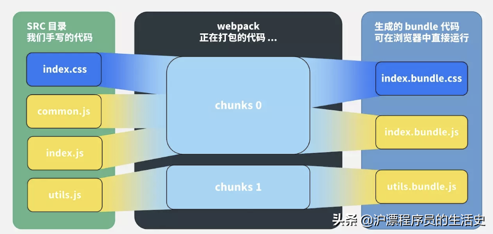
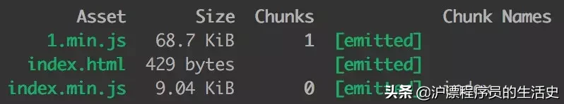
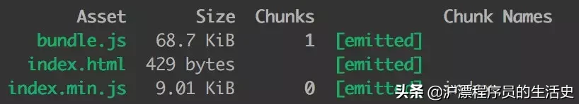
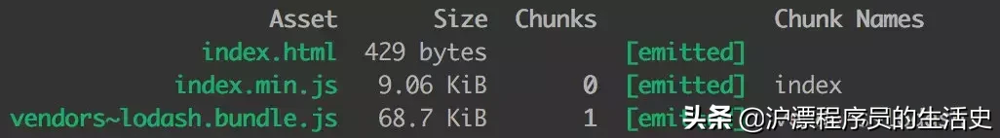

https://blog.csdn.net/qwtt24/article/details/114977470?utm_medium=distribute.pc_relevant_t0.none-task-blog-2%7Edefault%7EsearchFromBaidu%7Edefault-1.pc_relevant_baidujshouduan&depth_1-utm_source=distribute.pc_relevant_t0.none-task-blog-2%7Edefault%7EsearchFromBaidu%7Edefault-1.pc_relevant_baidujshouduan


#### 1.webpack 中，module，chunk 和 bundle 的区别是什么？


看这个图就很明白了：

对于一份同逻辑的代码，当我们手写了一个个的文件，它们无论是 ESM 还是 commonJS 或是 AMD，他们都是 module；
当我们写的 module 源文件传到 webpack 进行打包时，webpack 会根据文件引用关系生成 chunk
文件，webpack 会对这个 chunk 文件进行一些操作；
webpack 处理好 chunk 文件后，最后会输出 bundle 文件，这个 bundle
文件包含了经过加载和编译的最终源文件，所以它可以直接在浏览器中运行。
一般来说一个 chunk 对应一个 bundle，比如上图中的 utils.js -> chunks 1 -> utils.bundle.js；但也有例外，比如说上图中，我就用 MiniCssExtractPlugin 从 chunks 0 中抽离出了 index.bundle.css 文件。

一句话总结：
module，chunk 和 bundle 其实就是同一份逻辑代码在不同转换场景下的取了三个名字：我们直接写出来的是 module，webpack 处理时是 chunk，最后生成浏览器可以直接运行的 bundle。


#### 2.filename 和 chunkFilename 的区别

filename

filename 是一个很常见的配置，就是对应于 entry 里面的输入文件，经过webpack 打包后输出文件的文件名。比如说经过下面的配置，生成出来的文件名为 index.min.js。

```
{
 entry: {
 index: "../src/index.js"
 },
 output: {
 filename: "[name].min.js", // index.min.js
 }
}

```

chunkFilename

chunkFilename 指未被列在 entry 中，却又需要被打包出来的 chunk 文件的名称。一般来说，这个 chunk 文件指的就是要懒加载的代码。

比如说我们业务代码中写了一份懒加载 lodash 的代码：
```
// 文件：index.js
// 创建一个 button
let btn = document.createElement("button");
btn.innerHTML = "click me";
document.body.appendChild(btn);
// 异步加载代码
async function getAsyncComponent() {
 var element = document.createElement('div');
 const { default: _ } = await import('lodash');
 element.innerHTML = _.join(['Hello!', 'dynamic', 'imports', 'async'], ' ');
 return element;
}
// 点击 button 时，懒加载 lodash，在网页上显示 Hello! dynamic imports async
btn.addEventListener('click', () => {
 getAsyncComponent().then(component => {
 document.body.appendChild(component);
 })
})

```

我们的 webpack 不做任何配置，还是原来的配置代码：
```
{
 entry: {
 index: "../src/index.js"
 },
 output: {
 filename: "[name].min.js", // index.min.js
 }
}

```


这个 1.min.js 就是异步加载的 chunk 文件。文档里这么解释：

output.chunkFilename 默认使用 [id].js 或从 output.filename 中推断出的值（[name] 会被预先替换为 [id] 或 [id].）

文档写的太抽象，我们不如结合上面的例子来看：

output.filename 的输出文件名是 [name].min.js，[name] 根据 entry 的配置推断为 index，所以输出为 index.min.js；

由于 output.chunkFilename 没有显示指定，就会把 [name] 替换为 chunk 文件的 id 号，这里文件的 id 号是 1，所以文件名就是 1.min.js。

如果我们显式配置 chunkFilename，就会按配置的名字生成文件
```
{
 entry: {
 index: "../src/index.js"
 },
 output: {
 filename: "[name].min.js", // index.min.js
 chunkFilename: 'bundle.js', // bundle.js
 }
}

```



一句话总结：

filename 指列在 entry 中，打包后输出的文件的名称。

chunkFilename 指未列在 entry 中，却又需要被打包出来的文件的名称。


#### webpackChunkName

```
 // 在 import 的括号里 加注释 /* webpackChunkName: "lodash" */ ，为引入的文件取别名
 const { default: _ } = await import(/* webpackChunkName: "lodash" */ 'lodash');

 ```

 这时候打包生成的文件是这样的：

 

 现在问题来了，lodash 是我们取的名字，按道理来说应该生成 lodash.bundle.js 啊，前面的 vendors~ 是什么玩意？

其实 webpack 懒加载是用内置的一个插件 SplitChunksPlugin 实现的，这个插件里面有些默认配置项，比如说 automaticNameDelimiter，默认的分割符就是 ~，所以最后的文件名才会出现这个符号，这块儿内容我就不引申了，感兴趣的同学可以自己研究一下。


#### hash、chunkhash、contenthash 有什么不同？

hash 计算与整个项目的构建相关；

chunkhash 计算与同一 chunk 内容相关；

contenthash 计算与文件内容本身相关。


##### sourse-map 中 eval、cheap、inline 和 module 各是什么意思？
开发常用配置：

1.source-map

大而全，啥都有，就因为啥都有可能会让 webpack 构建时间变长，看情况使用。

2.cheap-module-eval-source-map

这个一般是开发环境（dev）推荐使用，在构建速度报错提醒上做了比较好的均衡。

3.cheap-module-source-map

一般来说，生产环境是不配 source-map 的，如果想捕捉线上的代码报错，我们可以用这个