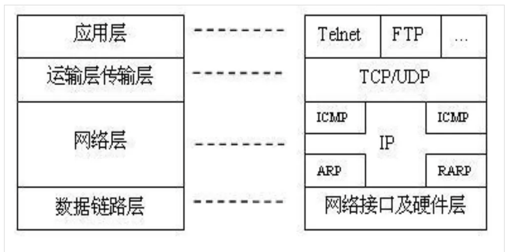

知乎：高赞回答
TCP/IP协议到底在讲什么？
https://www.zhihu.com/question/51074319

#### TCP/IP协议

TCP/IP（Transmission Control Protocol/Internet Protocol，传输控制协议/网际协议）是指能够在多个不同网络间实现信息传输的协议簇。TCP/IP协议不仅仅指的是TCP 和IP两个协议，而是指一个由FTP、SMTP、TCP、UDP、IP等协议构成的协议簇， 只是因为在TCP/IP协议中TCP协议和IP协议最具代表性，所以被称为TCP/IP协议。

TCP/IP传输协议，即传输控制/网络协议，也叫作网络通讯协议。它是在网络的使用中的最基本的通信协议。TCP/IP传输协议对互联网中各部分进行通信的标准和方法进行了规定。并且，TCP/IP传输协议是保证网络数据信息及时、完整传输的两个重要的协议。TCP/IP传输协议是严格来说是一个四层的体系结构，应用层、传输层、网络层和数据链路层都包含其中。

TCP/IP协议是Internet最基本的协议,其中

应用层的主要协议有Telnet、FTP、SMTP等，是用来接收来自传输层的数据或者按不同应用要求与方式将数据传输至传输层；

传输层的主要协议有UDP、TCP，是使用者使用平台和计算机信息网内部数据结合的通道，可以实现数据传输与数据共享；

网络层的主要协议有ICMP、IP、IGMP，主要负责网络中数据包的传送等；

而网络访问层，也叫网路接口层或数据链路层，主要协议有ARP、RARP，主要功能是提供链路管理错误检测、对不同通信媒介有关信息细节问题进行有效处理等。 [3] 

### 分别介绍TCP/IP协议中的四个层次。

#### 应用层

向用户提供一组常用的应用程序，比如电子邮件、文件传输访问、远程登录等。远程登录TELNET使用TELNET协议提供在网络其它主机上注册的接口。TELNET会话提供了基于字符的虚拟终端。文件传输访问FTP使用FTP协议来提供网络内机器间的文件拷贝功能。

应用层：应用层是TCP/IP协议的第一层，是直接为应用进程提供服务的。

（1）对不同种类的应用程序它们会根据自己的需要来使用应用层的不同协议，邮件传输应用使用了SMTP协议、万维网应用使用了HTTP协议、远程登录服务应用使用了有TELNET协议。 
（2）应用层还能加密、解密、格式化数据。 
（3）应用层可以建立或解除与其他节点的联系，这样可以充分节省网络资源。 

#### 运输层
作为TCP/IP协议的第二层，运输层在整个TCP/IP协议中起到了中流砥柱的作用。且在运输层中，TCP和UDP也同样起到了中流砥柱的作用。

提供应用程序间的通信。其功能包括：一、格式化信息流；二、提供可靠传输。为实现后者，传输层协议规定接收端必须发回确认，并且假如分组丢失，必须重新发送。

#### 网络层

网络层在TCP/IP协议中的位于第三层。在TCP/IP协议中网络层可以进行网络连接的建立和终止以及IP地址的寻找等功能。

负责相邻计算机之间的通信。其功能包括三方面。
一、处理来自传输层的分组发送请求，收到请求后，将分组装入IP数据报，填充报头，选择去往信宿机的路径，然后将数据报发往适当的网络接口。

二、处理输入数据报：首先检查其合法性，然后进行寻径--假如该数据报已到达信宿机，则去掉报头，将剩下部分交给适当的传输协议；假如该数据报尚未到达信宿，则转发该数据报。

三、处理路径、流控、拥塞等问题

#### 网络接口层
网络接口层：在TCP/IP协议中，网络接口层位于第四层。由于网络接口层兼并了物理层和数据链路层所以，网络接口层既是传输数据的物理媒介，也可以为网络层提供一条准确无误的线路。

