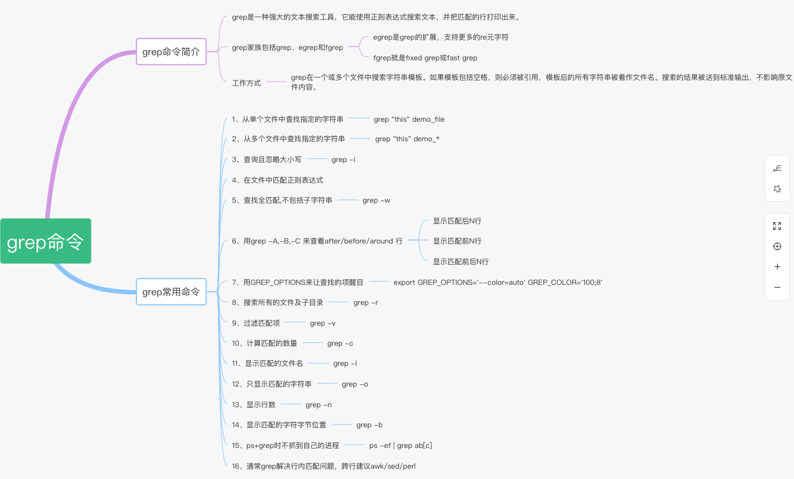

#### pwd 

pwd命令用于显示当前目录

#### 查看隐藏目录

ls -ah


### grep

Linux系统中grep命令是一种强大的文本搜索工具，它能使用正则表达式搜索文本，并把匹 配的行打印出来。


#### grep常用命令整理

* 1、从单个文件中查找指定的字符串
grep "something content" singleFilename

* 2、从多个文件中查找指定的字符串

```
grep "something content" demo_*

$ grep "test" d*
显示所有以d开头的文件中包含 test的行。
$ grep "test" aa bb cc
显示在aa，bb，cc文件中匹配test的行。
$ grep "[a-z]\{5\}" aa
显示所有包含每个字符串至少有5个连续小写字符的字符串的行。
```
* 3、查询且忽略大小写
grep -i

* 4、在文件中匹配正则表达式
基础正则表达式：
```
    ‘^‘： 锚定行首

　　‘$’： 锚定行尾 

　　‘.‘： 匹配任一一个字符

　　‘*’： 匹配零个或多个先前字符 

　　‘?‘：匹配其前面的字符0次或者1次；

　　‘+’：匹配其前面的字符1次或者多次；

　　‘{m}‘：匹配其前面的字符m次（\为转义字符）

　　‘{m,n}’：匹配其前面的字符至少m次，至多n次

　　()：将一个或多个字符捆绑在一起，当做一个整体进行处理，反向引用照常使用。

　　‘|’：或（注：‘C|cat’为C与cat，‘（C|c）at才是Cat与cat’）

　　‘[]‘： 匹配一个指定范围内的字符 | ‘[^]’匹配指定范围外的任意单个字符

　　‘\<‘或‘\b’：锚定词首，‘\>’或‘\b’：锚定词尾（可用\<PATTERN\>：匹配完整单词）

　　‘\(\)’：将多个字符当做一个整体进行处理

　　后向引用：引用前面的分组括号中的模式所匹配到的字符

　　分组括号中的模式匹配到的内容或被正则表达式引擎自动记录于内部的变量中：

　　\1：模式从左侧起，第一个左括号及与之匹配的右括号之间模式匹配到的内容

　　\2：模式从左侧起，第二个左括号及与之匹配的右括号之间模式匹配到的内容...
```

* 5、查找全匹配,不包括子字符串
```
grep -w
```
* 6、用grep -A,-B,-C 来查看after/before/around 行
```
    -A, 显示匹配后N行

    -B, 显示匹配前N行

    -C, 显示匹配前后N行
```
* 7 grep [options]
    ```
    grep [options]
        主要参数
        [options]主要参数：
        －c：只输出匹配行的计数。
        －I：不区分大小写（只适用于单字符）。
        －h：查询多文件时不显示文件名。
        －l：查询多文件时只输出包含匹配字符的文件名。
        －n：显示匹配行及行号。
        －s：不显示不存在或无匹配文本的错误信息。
        －v：显示不包含匹配文本的所有行。
    ```
* 8、计算匹配的数量
    ```
    grep -c
    ```
* 9、只显示匹配的字符串
    
    ```
    grep -o
    ```
* 10 显示行数
    ```
    grep -n
    ```
* 11 显示匹配的字符字节位置
    ```
    grep -b
    ```
* 12 显示匹配的文件名
    ```
    grep -l
    ```

*  grep 'w\(es\)t.*\1' aa

    ```
   grep 'w\(es\)t.*\1' README.md -n -b
    ```

    ```
    如果west被匹配，则es就被存储到内存中，并标记为1，然后搜索任意个字符(.*)，这些字符后面紧跟着 另外一个es(\1)，找到就显示该行。如果用egrep或grep -E，就不用”\”号进行转义，直接写成’w(es)t.*\1′就可以了
    ```

#### 注意
```
    grep命令使用复杂实例
    假设您正在’/usr/src/Linux/Doc’目录下搜索带字符 串’magic’的文件：
    $ grep magic /usr/src/Linux/Doc/*
    sysrq.txt:* How do I enable the magic SysRQ key?
    sysrq.txt:* How do I use the magic SysRQ key?
    其中文件’sysrp.txt’包含该字符串，讨论的是 SysRQ 的功能。
    默认情况下，’grep’只搜索当前目录。如果 此目录下有许多子目录，’grep’会以如下形式列出：
    grep: sound: Is a directory
    这可能会使’grep’ 的输出难于阅读。这里有两种解决的办法：
    明确要求搜索子目录：grep -r
    或忽略子目录：grep -d skip
    如果有很多 输出时，您可以通过管道将其转到’less’上阅读：
    $ grep magic /usr/src/Linux/Documentation/* | less
    这样，您就可以更方便地阅读。

    有一点要注意，您必需提供一个文件过滤方式(搜索全部文件的话用 *)。如果您忘了，’grep’会一直等着，直到该程序被中断。如果您遇到了这样的情况，按 <CTRL c> ，然后再试
```
