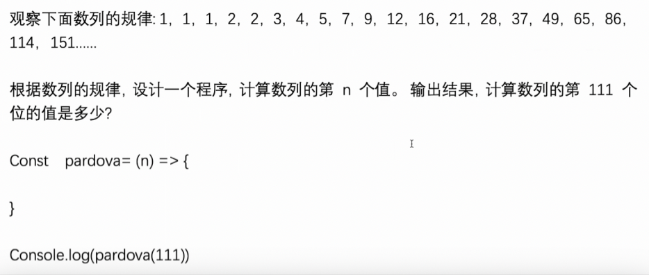
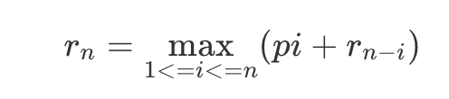

### 斐波拉契数列

首先我们来看看斐波拉契数列，这是一个大家都很熟悉的数列：
```
// f = [1, 1, 2, 3, 5, 8]
f(1) = 1;
f(2) = 1;
f(n) = f(n-1) + f(n -2); // n > 2
```
有了上面的公式，我们很容易写出计算f(n)的递归代码：

```
function fibonacci_recursion(n) {
  if(n === 1 || n === 2) {
    return 1;
  }

  return fibonacci_recursion(n - 1) + fibonacci_recursion(n - 2);
}

const res = fibonacci_recursion(5);
console.log(res);   // 5
```

现在我们考虑一下上面的计算过程，计算f(5)的时候需要f(4)与f(3)的值，计算f(4)的时候需要f(3)与f(2)的值，这里f(3)就重复算了两遍。在我们已知f(1)和f(2)的情况下，我们其实只需要计算f(3)，f(4)，f(5)三次计算就行了，但是从下图可知，为了计算f(5)，我们总共计算了8次其他值，里面f(3), f(2), f(1)都有多次重复计算。如果n不是5，而是一个更大的数，计算次数更是指数倍增长，这个递归算法的时间复杂度是O(2^n)。


#### 非递归的斐波拉契数列

为了解决上面指数级的时间复杂度，我们不能用递归算法了，而要用一个普通的循环算法。应该怎么做呢？我们只需要加一个数组，里面记录每一项的值就行了，为了让数组与f(n)的下标相对应，我们给数组开头位置填充一个0：
```
const res = [0, 1, 1];
f(n) = res[n];
```
我们需要做的就是给res数组填充值，然后返回第n项的值就行了:

```
function fibonacci_no_recursion(n) {
  let res = [0, 1, 1];
  for(let i = 3; i <= n; i++){
    res[i] = res[i-1] + res[i-2];
  }

  return res[n];
}

const num = fibonacci_no_recursion(5);
console.log(num);   // 5
```
上面的方法就没有重复计算的问题，因为我们把每次的结果都存到一个数组里面了，计算f(n)的时候只需要将f(n-1)和f(n-2)拿出来用就行了，因为是从小往大算，所以f(n-1)和f(n-2)的值之前就算好了。这个算法的时间复杂度是O(n)，比O(2^n)好的多得多。这个算法其实就用到了动态规划的思想。



```
// const arr  =[1, 1, 1,2, 2, 3,4,5,7,9,12]

function fibonacci(n){
	let res = [1,1,1,2,2]
	for(let i = 5; i<=n;i++ ){
		res[i] = res[i-3] + res[i-2]
		console.log(res[i])
	}
	return res[n]
}
console.log(fibonacci(111));

```

####  动态规划

动态规划主要有如下两个特点

最优子结构：一个规模为n的问题可以转化为规模比他小的子问题来求解。换言之，f(n)可以通过一个比他规模小的递推式来求解，在前面的斐波拉契数列这个递推式就是f(n) = f(n-1) + f(n -2)。一般具有这种结构的问题也可以用递归求解，但是递归的复杂度太高。
子问题的重叠性：如果用递归求解，会有很多重复的子问题，动态规划就是修剪了重复的计算来降低时间复杂度。但是因为需要存储中间状态，空间复杂度是增加了。
其实动态规划的难点是归纳出递推式，在斐波拉契数列中，递推式是已经给出的，但是更多情况递推式是需要我们自己去归纳总结的。


#### 钢条切割问题- http://www.dennisgo.cn/Articles/DataStructureAndAlgorithm/DP.html


动态规划方案的公式和前面的是一样的，我们用第二个简化了的公式：

动态规划就是不用递归，而是从底向上计算值，每次计算上面的值的时候，下面的值算好了，直接拿来用就行。所以我们需要一个数组来记录每个长度对应的最大收益。


```
const p = [0, 1, 5, 8, 9, 10, 17, 17, 20, 24, 30]; // 下标表示钢条长度，值表示对应价格

function cut_rod3(n) {
  let r = [0, 1];   // r数组记录每个长度的最大收益

  for(let i = 2; i <=n; i++) {
    let max = p[i];
    for(let j = 1; j <= i; j++) {
      let sum = p[j] + r[i - j];
      console.log('i:'，i,'j:'j,'sum:',sum)

      if(sum > max) {
        max = sum;
      }
    }

    r[i] = max;
  }

  console.log(r);
  return r[n];
}

cut_rod3(9);  // 结果还是返回 25
```
