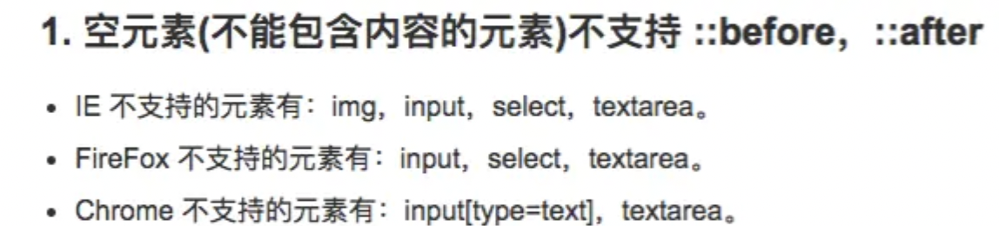

https://www.jianshu.com/p/2c33921d5a68

### 1px 的问题


```
1px 不够准确，应该是1物理像素
是指设置边框 为1px css像素，在 普通屏幕 下1px，高清屏幕 (dpr为2)下2px的情况。

是由于不同移动设备的dpr不同，导致1px css像素，转换成物理像素后显示不一样。

window.devicePixelRatio=物理像素 /CSS像素
```
```
目前主流的屏幕DPR=2 （iPhone 8）,或者3 （iPhone 8 Plus）。

拿2倍屏来说，设备的物理像素要实现1像素，而DPR=2，所以css 像素只能是 0.5。

一般设计稿是按照750来设计的，它上面的1px是以750来参照的，而我们写css样式是以设备375为参照的，所以我们应该写的0.5px就好了啊！ 试过了就知道，iOS 8+系统支持，安卓系统不支持。

```
####  使用伪元素

将伪元素设置绝对定位，并且和父元素的左上角对齐，将width 设置100%，height设置为1px，然后进行在Y方向缩小0.5倍

####  1px border-top
```
.setOnePx{
        position: relative;
        width: 100px;
        height: 200px;
        background-color: #ccc;
	}
	.setOnePx::after{
	    position: absolute;
	    content: '';
	    background-color: red;
	    display: block;
	    width: 100%;
	    transform-origin: 0 0;
	    height: 1px; /*Y轴*/
	    transform: scale(1, 0.5);
	    top: 0;
	    left: 0;
	}
```

#### 1px  border
```
.setOnePx{
    position: relative;
    width: 100px;
    height: 200px;
    background-color: #ccc;
    float: left;
    /*margin: 1px;*/
}
.setOnePx::after{
    position: absolute;
    top: 0; 
    left: 0;
    width: 200%;
    height: 200%;
    content: '&nbsp;'; 
    border: 1px solid red;
    transform-origin: 0 0; 
    transform: scale(.5);
    box-sizing: border-box;
}
```
### 伪元素注意点




### scss（sass） 版本

```
@mixin thinBorder($directionMaps: bottom, $color: #ccc, $radius:(0, 0, 0, 0), $position: after) {
    // 是否只有一个方向
    $isOnlyOneDir: string==type-of($directionMaps);

    @if ($isOnlyOneDir) {
        $directionMaps: ($directionMaps);
    }

    @each $directionMap in $directionMaps {
        border-#{$directionMap}: 1px solid $color;
    }

    // 判断圆角是list还是number
    @if(list==type-of($radius)) {
        border-radius: nth($radius, 1) nth($radius, 2) nth($radius, 3) nth($radius, 4);
    }

    @else {
        border-radius: $radius;
    }

    @media only screen and (-webkit-min-device-pixel-ratio: 2) {
        & {
            position: relative;

            // 删除1像素密度比下的边框
            @each $directionMap in $directionMaps {
                border-#{$directionMap}: none;
            }
        }

        &:#{$position} {
            content: "";
            position: absolute;
            top: 0;
            left: 0;
            display: block;
            width: 200%;
            height: 200%;
            transform: scale(0.5);
            box-sizing: border-box;
            padding: 1px;
            transform-origin: 0 0;
            pointer-events: none;
            border: 0 solid $color;

            @each $directionMap in $directionMaps {
                border-#{$directionMap}-width: 1px;
            }

            // 判断圆角是list还是number
            @if(list==type-of($radius)) {
                border-radius: nth($radius, 1)*2 nth($radius, 2)*2 nth($radius, 3)*2 nth($radius, 4)*2;
            }

            @else {
                border-radius: $radius*2;
            }

        }
    }

    @media only screen and (-webkit-min-device-pixel-ratio: 3) {
        &:#{$position} {

            // 判断圆角是list还是number
            @if(list==type-of($radius)) {
                border-radius: nth($radius, 1)*3 nth($radius, 2)*3 nth($radius, 3)*3 nth($radius, 4)*3;
            }

            @else {
                border-radius: $radius*3;
            }

            width: 300%;
            height: 300%;
            transform: scale(0.3333);
        }
    }
}
```

#### 使用

```
 .border-top-left-red-1px{
    @include thinBorder((top,left), red);
 }
```